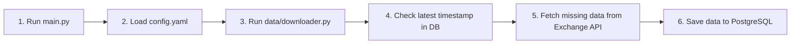

# CryptoSight Data Ingestion Pipeline

CryptoSight is a robust data ingestion pipeline designed to fetch historical and real-time cryptocurrency OHLCV (Open, High, Low, Close, Volume) data from Binance or Bybit and save it directly into a PostgreSQL database in a clean, timezone-independent UTC format.

It is designed to be fully automatic: it checks the database for existing records and resumes fetching from the latest available timestamp to prevent duplicates and gaps.

---

## 📁 Repository Structure

```text
cryptosight/
├── data/
│   ├── binance/
│   │   ├── binance_client_exch.py  # Binance data fetching client
│   │   ├── config.yaml            # Configuration file for Binance symbol ingestion
│   │   └── main.py                # Entry point script to run Binance ingestion
│   ├── bybit/
│   │   ├── bybit_client_exch.py    # Bybit data fetching client with forward chunk pagination
│   │   ├── config.yaml            # Configuration file for Bybit symbol ingestion
│   │   └── main.py                # Entry point script to run Bybit ingestion
│   └── downloader.py              # Central orchestrator (processes gaps, filters incomplete candles, handles merging)
├── logs/
│   ├── binance.log                # Execution logs for Binance
│   └── bybit.log                  # Execution logs for Bybit
├── utils/
│   ├── db.py                      # PostgreSQL connection manager (timezone forced to UTC)
│   └── logger.py                  # Logger helper
├── .env                           # Environment file for database credentials (git-ignored)
├── requirements.txt               # Project dependencies
└── README.md                      # Documentation
```

---

## ⚙️ How It Works (Data Flow)



1. **Start**: The user runs the main script for an exchange (e.g. `python data/binance/main.py`).
2. **Config**: The script reads symbols, timeframe, and target dates from the exchange's `config.yaml`.
3. **Database Check**: The pipeline checks the database for the latest stored timestamp to avoid redownloading existing data.
4. **Fetch**: The exchange client fetches missing data from the exchange APIs.
   - *Bybit Client* uses a forward pagination chunking loop of 1000 candles to ensure complete historical data.
5. **Save**: The database manager inserts the new data into PostgreSQL.
   - Timestamps are stored as `TIMESTAMP` (without timezone) to keep them strictly in UTC, preventing timezone offset conversions (`+05:00`).
   - The active incomplete candle (last row) is dropped before saving to ensure data integrity.

---

## 🚀 Setup & How to Run

### 1. Install Dependencies
Create a virtual environment, activate it, and install the required packages:
```bash
# Create and activate virtual environment
python -m venv venv
venv\Scripts\activate  # On Windows

# Install requirements
pip install -r requirements.txt
```

### 2. Configure Database Credentials
Create a `.env` file in the root directory (based on your PostgreSQL configuration):
```env
DB_HOST=localhost
DB_PORT=5432
DB_NAME=postgres
DB_USER=your_username
DB_PASSWORD=your_password
```

### 3. Edit Ingestion Settings
Update the settings in [data/binance/config.yaml](file:///d:/Neurog_Internship/cryptosight/data/binance/config.yaml) or [data/bybit/config.yaml](file:///d:/Neurog_Internship/cryptosight/data/bybit/config.yaml):
- `symbols`: List of symbols to ingest (e.g., `BTC`, `SOL`).
- `timeframe`: Candlestick interval (e.g., `1m`, `5m`, `1h`).
- `start_time`: Time to begin fetching from (e.g., `2026-06-22 00:00:00`).

### 4. Run the Ingestion Pipeline
To ingest data from Binance:
```bash
python data/binance/main.py
```

To ingest data from Bybit:
```bash
python data/bybit/main.py
```

---

## 🛠️ Advanced Features

### Ad-hoc Data Merging (without DB writes)
If you want to fetch database data and merge it with current live exchange data *without* writing back to the PostgreSQL database, use the `fetch_and_merge_missing_data` function in `data/downloader.py`:

```python
from cryptosight.data.downloader import fetch_and_merge_missing_data

# Fetches stored data, finds missing range up to now, fetches from exchange,
# merges them, and saves the output to a CSV file.
df = fetch_and_merge_missing_data(
    exchange="bybit",
    symbol="BTC",
    timeframe="1m",
    output_path="logs/merged_btc_data.csv"
)
```
