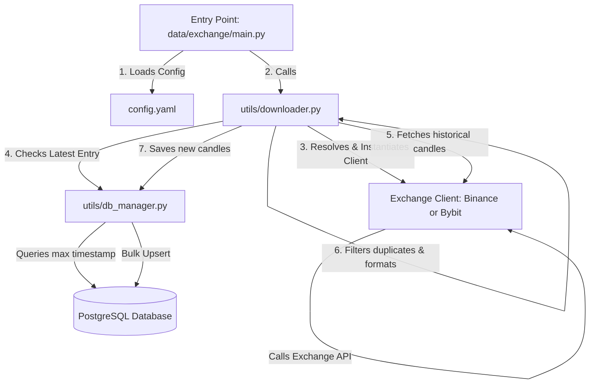

# CryptoSight Data Ingestion Pipeline

CryptoSight is a lightweight, scalable data ingestion pipeline designed to fetch historical and real-time cryptocurrency OHLCV (Open, High, Low, Close, Volume) data from multiple exchanges (Binance, Bybit) and save it directly into a PostgreSQL database.

---

## 📁 Repository Structure

```text
cryptosight/
├── data/
│   ├── binance/
│   │   ├── binance_client_exch.py  # Native client for fetching Binance historical candles
│   │   ├── config.yaml            # Ingestion settings for Binance (symbols, timeframe, start_time, etc.)
│   │   └── main.py                # Entry point script for Binance data ingestion
│   └── bybit/
│       ├── bybit_client_exch.py    # Client for fetching Bybit historical candles (handles pagination/reversal)
│       ├── config.yaml            # Ingestion settings for Bybit (symbols, timeframe, start_time, etc.)
│       └── main.py                # Entry point script for Bybit data ingestion
├── logs/
│   └── app.log                    # Local application logs containing pipeline status and execution logs
├── utils/
│   ├── db_manager.py              # PostgreSQL manager (handles connection, table creation, and bulk upserts)
│   ├── downloader.py              # Orchestrator matching exchange names to their respective clients and saving data
│   └── logger.py                  # Standardized logging configuration utility
├── .env                           # Environment file containing DB credentials (DB_HOST, DB_USER, DB_PASSWORD, etc.)
├── requirements.txt               # Project dependencies (psycopg2, python-binance, pybit, pyyaml, etc.)
└── README.md                      # Project documentation (this file)
```

---

## ⚙️ How It Works (Data Flow)



1. **Initialization**: You run the main script for an exchange, e.g., `python data/binance/main.py`.
2. **Configuration Loading**: The script loads configurations (such as symbols, timeframes, start/end dates) from its local `config.yaml`.
3. **Database Check & Resuming**: The centralized `utils/downloader.py` checks the database for existing records of that symbol/timeframe. If data exists, it automatically resumes downloading from the latest saved timestamp to avoid duplicate API calls.
4. **Data Ingestion**: The corresponding client (`BinanceClient` or `BybitClient`) queries the exchange API for OHLCV data.
5. **Database Upsert**: The `utils/db_manager.py` executes a bulk upsert (`ON CONFLICT DO UPDATE`) to store the fetched candles safely without duplicate primary key errors.

---

## 🔍 Redundancy Analysis

Upon checking the codebase, here are the observations regarding redundancy:

1. **`main.py` Duplication**:
   - `data/binance/main.py` and `data/bybit/main.py` are almost identical. They perform the exact same task of loading a local `config.yaml` and calling `download_exchange_data`.
   - *Improvement*: You could have a single `main.py` at the root directory of the project that takes the exchange name as a command-line argument (e.g., `python main.py --exchange binance`) and dynamically loads the config for that exchange.

2. **Database Helper Upserts**:
   - Both exchange clients return standardized OHLCV formats, and database tables are handled dynamically using schemas (`binance_data` vs `bybit_data`). This is clean, modular, and keeps database code highly reusable inside [utils/db_manager.py](file:///d:/Neurog_Internship/cryptosight/utils/db_manager.py).

3. **Exchange Clients**:
   - Both clients use exchange-specific SDKs (`python-binance` and `pybit`). Because Binance and Bybit have completely different pagination mechanisms, API payloads, and response sorting order, keeping them as separate modules in `data/binance/binance_client_exch.py` and `data/bybit/bybit_client_exch.py` is the correct design decision.
