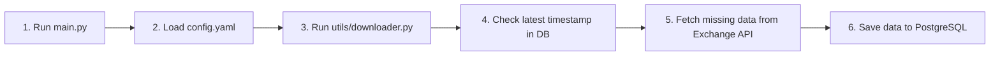

# CryptoSight Data Ingestion Pipeline

CryptoSight is a lightweight data ingestion pipeline designed to fetch historical and real-time cryptocurrency OHLCV (Open, High, Low, Close, Volume) data from Binance or Bybit and save it directly into a PostgreSQL database.

---

## 📁 Repository Structure

```text
cryptosight/
├── data/
│   ├── binance/
│   │   ├── binance_client_exch.py  # Binance data fetching client
│   │   ├── config.yaml            # Configuration file for Binance symbol ingestion
│   │   └── main.py                # Entry point script to run Binance ingestion
│   └── bybit/
│       ├── bybit_client_exch.py    # Bybit data fetching client
│       ├── config.yaml            # Configuration file for Bybit symbol ingestion
│       └── main.py                # Entry point script to run Bybit ingestion
├── logs/
│   └── app.log                    # Execution logs
├── utils/
│   ├── db_manager.py              # PostgreSQL database manager (tables, connection, upserting data)
│   ├── downloader.py              # Central orchestrator that fetches and saves the data
│   └── logger.py                  # Logger helper
├── .env                           # Environment file for database credentials
├── requirements.txt               # Project dependencies
└── README.md                      # Documentation
```

---

## ⚙️ How It Works (Data Flow)



### Explanation:
1. **Start**: Run `python data/binance/main.py` (or Bybit).
2. **Config**: The script reads the configurations (symbols, timeframe, start time) from the local `config.yaml`.
3. **Database Check**: Before fetching, the pipeline checks the database for existing records so it only fetches new data.
4. **Fetch**: The respective exchange client downloads the historical candlestick data from the API.
5. **Save**: The database manager inserts the new data into PostgreSQL.
