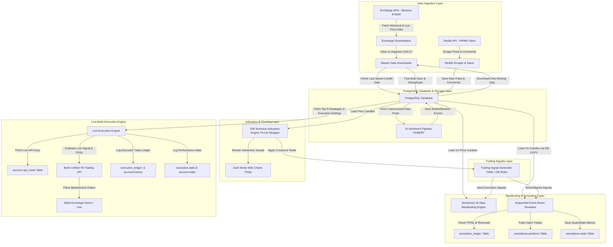

<div id="top"></div>
<div align="center">

# 🚀 CryptoSight: Enterprise Quantitative Data & Technical Analysis Engine

[](https://www.linkedin.com/in/afnanshoukat)
[](https://github.com/21Afnan)
[](https://python.org)
[](https://postgresql.org)
[](https://ta-lib.org)
[](https://plotly.com)

**An institutional, production-grade cryptocurrency data ingestion, dynamic technical analysis, ML feature engineering, backtesting, event simulation, and live exchange execution framework built for quantitative analysts and financial engineers.**

[🌟 Key Features](#features) • [🏗️ System Flowchart](#flowchart) • [🗄️ Database Architecture](#database) • [⚡ Quick Start Guide](#quickstart) • [📁 Repository Structure](#structure) • [👨‍💻 Author](#author)

</div>

---

<div id="features"></div>

## 🌟 Executive Summary & 10 Quantitative Pillars

**CryptoSight** bridges the gap between raw exchange data feeds and institutional quantitative strategies. It eliminates boilerplate data cleaning, API pagination headaches, and indicator mapping complexities by providing an end-to-end automated framework organized into **10 Quantitative Pillars**:

| Status | Pillar | Module | High-Level Institutional Functionality |
| :---: | :--- | :--- | :--- |
| 🟢 **LIVE** | **1. Ingestion** | `cryptosight.data` | **Binance & Bybit Ingestion** with smart SQL gap-fill & live candle stripping (`latest_ts` synchronization). |
| ⚡ **FAST** | **2. TA Engine** | `cryptosight.tal_Indicators` | **Dynamic 158 TA-Lib Wrapper** utilizing Python `__getattr__` interception with parameter hierarchy & dark-mode charts. |
| 🎯 **RULES** | **3. Signals** | `cryptosight.signals` | **YAML-Driven Signal Pipeline** with look-back persistence windows and automatic `.shift(1)` look-ahead bias prevention. |
| 🧪 **QUANT** | **4. Backtester** | `cryptosight.backtesting` | **Vectorized 10-Step Backtesting Engine** simulating realistic commissions (`0.05%`), slippage (`0.02%`), and dynamic TP/SL. |
| 🧠 **NLP** | **5. Sentiment** | `cryptosight.sentiment` | **Reddit NLP Pipeline** with HTML/contraction cleaning, bot filtering, and **Hugging Face FinBERT** chunk-averaging. |
| 🛡️ **CLEAN** | **6. ML Data** | `cryptosight.ml` | **Quant ML Feature Builder** generating lag-free features (`.shift(1)`), Log Return (`np.log`), and 3-class target matrices. |
| 📊 **BENCH** | **7. Evaluation** | `cryptosight.preprocessing` | **Institutional Preprocessing & Leaderboard** testing ADF/KPSS stationarity across `Robust, MinMax, FracDiff, Winsorize, Log, Gaussian`. |
| 📉 **METRICS** | **8. Analytics** | `cryptosight.stats` | **QuantStats Analytics & Frontend Charts Engine** computing 59+ ratios (`CAGR, Sharpe, Calmar`) and exporting `all_charts.json`. |
| ⚙️ **SIMUL** | **9. Simulation** | `cryptosight.simulator` | **Sequential Event-Driven Trading Simulator Engine** running minute-by-minute with TP/SL validation, dynamic reversal logic, and dedicated `simulation_ledger.<strategy_name>` SQL tables. |
| 🚀 **EXEC** | **10. Live Execution** | `cryptosight.execution` | **Automated Bybit Live Execution Bot** with DB credential lookup (`account.api_creds`), dynamic `top_n` strategy selection, Pybit V5 API order routing, `execution_ledger.<strategy_name>` trade history, and Task Scheduler support. |


> [!IMPORTANT]
> **Zero Data Leakage Guarantee (`.shift(1)`)**: Every single technical indicator, moving average, and pattern calculated inside CryptoSight is explicitly shifted forward by 1 period (`Bar T -> Bar T+1`) before generating target labels or execution signals. This mathematically prevents future look-ahead bias during historical backtests, event simulations, and ML cross-validation.

<div align="right"><a href="#top">⬆️ Back to Top</a></div>

---

<div id="flowchart"></div>

## 🏗️ System Architecture & Pipeline Flowchart


```mermaid
graph TD
    subgraph Data_Ingestion["Data Ingestion Layer"]
        API["Exchange APIs - Binance & Bybit"] -->|"Fetch Historical & Live Price Data"| Fetcher["Exchange Downloaders"]
        Fetcher -->|"Clean & Organize OHLCV"| Facade["Master Data Downloader"]
        Reddit["Reddit API - PRAW Client"] -->|"Scrape Posts & Comments"| RedditScraper["Reddit Scraper & Saver"]
    end

    subgraph Database_Layer["PostgreSQL Database & Storage Layer"]
        Facade -->|"Check Last Saved Candle Date"| SQL_Check["PostgreSQL Database"]
        SQL_Check -->|"Download Only Missing Gap"| Facade
        Facade -->|"Fast Bulk Save & Deduplicate"| SQL_Check
        
        RedditScraper -->|"Save Raw Posts & Comments"| SQL_Check
        SQL_Check -->|"Fetch Unprocessed Raw Posts"| AI_Sentiment["AI Sentiment Pipeline FinBERT"]
        AI_Sentiment -->|"Save Bullish/Bearish Scores"| SQL_Check
    end

    subgraph Indicators_Layer["Indicators & Charting Layer"]
        SQL_Check -->|"Load Price Candles"| Engine["158 Technical Indicators Engine TA-Lib Wrapper"]
        Engine -->|"Render Interactive Visuals"| Dashboard["Dark Mode Web Charts Plotly"]
    end

    subgraph Signals_Layer["Trading Signals Layer"]
        Engine -->|"Apply Crossover Rules"| Signals["Trading Signal Generator YAML / DB Rules"]
    end

    subgraph Simulation_Layer["Backtesting & Simulation Layer"]
        SQL_Check -->|"Load 1m Price Candles"| Backtester["Vectorized 10-Step Backtesting Engine"]
        Signals -->|"Send Execution Signals"| Backtester
        
        SQL_Check -->|"Load 1m Candles via DB COPY"| Simulator["Sequential Event-Driven Simulator"]
        Signals -->|"Send Aligned Signals"| Simulator
        Simulator -->|"Check TP/SL & Reversals"| SimLedger["simulation_ledger.<strategy_name> Table"]
        Simulator -->|"Track Open Trades"| SimPos["simulations.positions Table"]
        Simulator -->|"Save QuantStats Metrics"| SimStats["simulations.stats Table"]
    end

    subgraph Live_Execution_Layer["Live Bybit Execution Engine"]
        SQL_Check -->|"Fetch Top N Strategies & Execution Settings"| ExecEngine["Live Execution Engine"]
        ExecEngine -->|"Fetch Live API Keys"| AccCreds["account.api_creds Table"]
        ExecEngine -->|"Evaluate Live Signal & TP/SL"| BybitAPI["Bybit Unified V5 Trading API"]
        BybitAPI -->|"Place Market/Limit Orders"| BybitExchange["Bybit Exchange Demo / Live"]
        ExecEngine -->|"Log Executed Trade Ledger"| ExecLedger["execution_ledger.<strategy_name> & account.history"]
        ExecEngine -->|"Log Performance Stats"| ExecStats["execution.stats & account.stats"]
    end
```

<div align="right"><a href="#top">⬆️ Back to Top</a></div>

---

<div id="database"></div>

## 🗄️ Database Architecture & Schemas

CryptoSight utilizes a highly structured, enterprise **PostgreSQL Database** organized into 6 distinct schemas with strict duplicate prevention and upsert logic:

```text
PostgreSQL Database ('postgres')
├── account/                           # User Account & Global Live Execution History
│   ├── api_creds                      # Exchange API keys, secrets & demo flags (Bybit/Binance)
│   ├── history                        # Central account-wide completed trade ledger (UNIQUE on strategy_id, entry_time)
│   └── stats                          # Account-level performance metrics per coin symbol (ON CONFLICT DO UPDATE)
├── metadata/                          # System Configuration & Strategy Registries
│   ├── strategy_data                  # Registered strategies, symbols, timeframes, category & order_type
│   ├── simulator_config               # Strategy risk rules (balance, commission, slippage, position sizing)
│   ├── execution_settings             # Runtime global settings (top_n strategies to run)
│   └── market_data                    # Metadata index of downloaded OHLCV ranges
├── execution/                         # Live Exchange Execution Engine State
│   ├── positions                      # Currently active open live positions & TP/SL triggers
│   └── stats                          # Strategy-specific live performance metrics & QuantStats JSON
├── execution_ledger/                  # Live Exchange Execution Trade History Ledgers
│   └── <strategy_name>                # Strategy-specific live execution trade history table (named after strategy)
├── simulations/                       # Backtest & Event Simulator Engine State
│   ├── positions                      # Simulated active open positions
│   └── stats                          # Simulated performance metrics & drawdown reports
└── simulation_ledger/                 # Backtest & Event Simulator Trade History Ledgers
    └── <strategy_name>                # Simulated strategy trade history table (named after strategy)
```

### Key Database Design Principles:
1. **Separation of Operational & Ledger Data**:
   - Operational tables (`positions`, `stats`) are isolated in `execution` and `simulations` schemas using numeric `strategy_id` keys for fast relational queries.
   - Completed trade ledgers are organized into dedicated **`execution_ledger`** and **`simulation_ledger`** schemas with clean, human-readable table names derived from strategy names (e.g., `execution_ledger.ada_15m_rsi_momentum`, `simulation_ledger.btc_1h_rsi_mean_reversion`).
2. **Duplicate Prevention & Conflict Resolution**:
   - All trade history tables enforce `UNIQUE (entry_time)` constraints.
   - Insertion queries utilize `ON CONFLICT (entry_time) DO UPDATE SET ...` to overwrite and update existing trade details without creating duplicates.
   - Startup migration scripts automatically purge legacy ctid/ID duplicates for existing databases.

<div align="right"><a href="#top">⬆️ Back to Top</a></div>

---

<div id="quickstart"></div>

## ⚡ Quick Start Guide & Running Pipelines

### 1️⃣ **Environment Setup**
Clone the repository and set up your Python environment:
```bash
# Clone repository
git clone https://github.com/21Afnan/cryptosight.git
cd cryptosight

# Create and activate virtual environment
python -m venv venv
venv\Scripts\activate.bat

# Install dependencies
pip install -r requirements.txt
```

### 2️⃣ **Running Data Ingestion & Market Downloads**
```bash
# Download Binance Market Data
python -m cryptosight.data.binance.main

# Download Bybit Market Data
python -m cryptosight.data.bybit.main
```

### 3️⃣ **Running Event Simulator (Backtesting)**
```bash
# Run Simulator Engine directly
python -m cryptosight.simulator.main

# Or execute via Windows Batch script
simulator\run_simulator.bat
```

### 4️⃣ **Running Live Bybit Execution Engine**
To execute top-performing strategies automatically on Bybit:
```bash
# Run Execution Engine directly
python -m cryptosight.execution.main

# Or run via Windows Batch script (Task Scheduler compatible)
execution\run_execution.bat
```

<div align="right"><a href="#top">⬆️ Back to Top</a></div>

---

<div id="structure"></div>

## 📁 Complete Repository Structure

```text
cryptosight/
├── execution/                     # Automated Bybit Live Execution Engine
│   ├── main.py                    # Master execution runner & pipeline entry point
│   ├── executor.py                # Class-based ExecutionEngine handling signals, TP/SL & DB updates
│   ├── client.py                  # Authenticated BybitExecutionClient (Pybit V5 API & credential loader)
│   └── run_execution.bat          # Task Scheduler Windows batch execution script
├── simulator/                     # Sequential event-driven trading simulator engine
│   ├── main.py                    # Master simulator entry point
│   ├── simulator.py               # SimulatorEngine with 1m candle loop, TP/SL & ledger logging
│   ├── config.yaml                # Simulator default parameter specifications
│   └── run_simulator.bat          # Windows batch runner script
├── data/                          # Exchange downloaders with smart SQL gap fill & live bar protection
│   ├── binance/                   # Binance API fetcher, config.yaml, main.py & run_binance.bat
│   └── bybit/                     # Bybit API fetcher, config.yaml, main.py & run_bybit.bat
├── tal_Indicators/                # Dynamic __getattr__ wrapper for all 158 TA-Lib technical indicators
├── signals/                       # YAML/DB-driven quant signal generator & multi-crossover rule engine
├── backtesting/                   # Vectorized 10-step backtester modeling commissions, slippage & SQL ledger
├── sentiment/                     # PRAW Reddit scraper, text cleaning engine & Hugging Face FinBERT classifier
├── ml/                            # Comprehensive end-to-end Machine Learning ecosystem
│   ├── main.py                    # Master orchestrator for feature generation, chron-splitting & inference
│   ├── ml_config.yaml             # Centralized YAML spec for features, models, splits & signal thresholds
│   ├── preprocessing/             # Robust in-memory QuantPreprocessors and MLFeatureBuilders
│   ├── models/                    # Modular training pipelines (XGBoost, LightGBM, Random Forest, PyTorch LSTM)
│   ├── inference/                 # Standalone out-of-sample forward-inference engine (inference_pipeline.py)
│   └── evaluation/                # Master JSON report builders linking hyperparameters to evaluation metrics
├── preprocessing/                 # Preprocessing benchmark suite & multi-model evaluation leaderboard
├── stats/                         # Institutional statistical analytics & frontend charts suite (QuantStats + Plotly)
├── csv_files/                     # Automated export directory for predictions, reports & master tables
├── logs/                          # Rotating execution logs with SafeRotatingFileHandler (binance.log, bybit.log, db.log)
├── utils/                         # Shared utilities (db.py connection pooling, metadata.py schema managers, logger.py)
├── run_execution.bat              # Root Windows batch script for Task Scheduler
├── .env                           # Database & exchange credentials (git-ignored)
├── README.md                      # Comprehensive enterprise documentation
└── requirements.txt               # Python package dependencies
```

<div align="right"><a href="#top">⬆️ Back to Top</a></div>

---

<div id="author"></div>
<div align="center">

## 👨‍💻 Built & Engineered by Afnan Shoukat

**Full-Stack Quantitative Engineer • Financial Data Scientist • Algorithmic Systems Architect**

[](https://www.linkedin.com/in/afnanshoukat)
[](https://github.com/21Afnan)

*Designed with enterprise precision, zero data leakage, and institutional quantitative rigor.*

© 2026 CryptoSight. All rights reserved.

</div>
