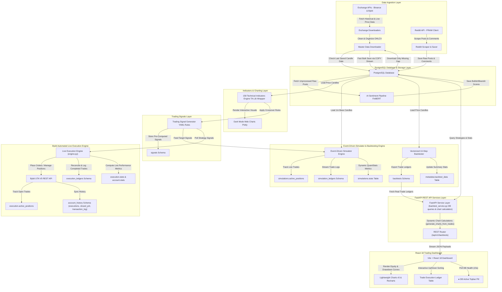

<div id="top"></div>
<div align="center">

# 🚀 CryptoSight: Enterprise Quantitative Data, Algorithmic Engine & Trading Terminal

[](https://www.linkedin.com/in/afnanshoukat)
[](https://github.com/21Afnan)
[](https://python.org)
[](https://fastapi.tiangolo.com)
[](https://reactjs.org)
[](https://postgresql.org)
[](https://ta-lib.org)

**An institutional, production-grade cryptocurrency data ingestion, dynamic technical analysis, NLP sentiment classification, ML feature engineering, vectorized backtesting, FastAPI REST backend services, and interactive React trading dashboard.**

[🌟 Key Features](#features) • [🏗️ System Flowchart](#flowchart) • [🗄️ Database Architecture](#database) • [🔬 Module Deep Dive](#modules) • [⚡ Quick Start Guide](#quickstart) • [📁 Repository Structure](#structure) • [👨‍💻 Author](#author)

</div>

---

<div id="features"></div>

## 🌟 Executive Summary & 10 Quantitative Pillars

**CryptoSight** bridges the gap between raw exchange data feeds and institutional quantitative strategies. It eliminates boilerplate data cleaning, API pagination headaches, and indicator mapping complexities by providing an end-to-end automated framework organized into **10 Quantitative Pillars**:

| Status | Pillar | Module | High-Level Institutional Functionality |
| :---: | :--- | :--- | :--- |
| 🟢 **LIVE** | **1. Ingestion** | `cryptosight.data` | **Binance & Bybit Ingestion** with smart SQL gap-fill, COPY binary streams, and live candle stripping (`latest_ts` synchronization). |
| ⚡ **FAST** | **2. TA Engine** | `cryptosight.tal_Indicators` | **Dynamic 158 TA-Lib Wrapper** utilizing Python `__getattr__` interception with parameter hierarchy & Plotly visual rendering. |
| 🎯 **RULES** | **3. Signals** | `cryptosight.signals` | **YAML-Driven Signal Pipeline** with multi-crossover conditions and automatic `.shift(1)` look-ahead bias prevention. |
| 🔄 **EVENT** | **4. Simulator Engine**| `cryptosight.simulator` | **Event-Driven Simulation Engine** maintaining live active positions (`simulations.active_positions`), trade ledgers (`simulation_ledgers`), and dynamic performance metrics (`simulations.stats`). |
| 🧪 **QUANT** | **5. Backtester** | `cryptosight.backtesting` | **Vectorized 10-Step Backtesting Engine** simulating realistic commissions (`0.05%`), slippage (`0.02%`), dynamic TP/SL, and SQL ledger exports. |
| 🧠 **NLP** | **6. Sentiment** | `cryptosight.sentiment` | **Reddit NLP Pipeline** with PRAW scraping, text cleaning, and **Hugging Face FinBERT** chunk-averaged classification. |
| 🛡️ **CLEAN** | **7. ML Ecosystem** | `cryptosight.ml` | **Quant ML Engine** with lag-free feature extraction (`.shift(1)`), stationarity scaling, XGBoost/LightGBM/LSTM models, and out-of-sample forward inference. |
| 📊 **STATS** | **8. Analytics** | `cryptosight.stats` | **Institutional QuantStats Suite** computing 59+ financial performance ratios (`CAGR, Sharpe, Sortino, Calmar`) embedded as dynamic PostgreSQL tabular columns. |
| 🌐 **API & UI** | **9. Terminal Platform** | `cryptosight.backend` & `frontend` | **FastAPI REST API & React Dashboard** with live PostgreSQL trade ledger chart generation (`generate_charts_from_trades`), topbar health polling (`● DB Active`), interactive Up/Down table header sorting, and soft eye-friendly red design system. |
| 🤖 **BOT** | **10. Live Execution** | `cryptosight.execution` | **Automated Bybit Live Execution Engine** managing live positions (`execution.active_positions`), strategy ledgers (`execution_ledgers`), exchange history sync (`account_history.*`), TP/SL/Reversal reconciliation, and real-time execution stats (`execution.stats` & `account.stats`). |


> [!IMPORTANT]
> **Zero Data Leakage Guarantee (`.shift(1)`)**: Every single technical indicator, moving average, and pattern calculated inside CryptoSight is explicitly shifted forward by 1 period (`Bar T -> Bar T+1`) before generating target labels or execution signals. This mathematically prevents future look-ahead bias during historical backtests and ML cross-validation.

<div align="right"><a href="#top">⬆️ Back to Top</a></div>

---

<div id="flowchart"></div>

## 🏗️ System Architecture & Full-Stack Pipeline Flowchart


```mermaid
graph TD
    subgraph Data_Ingestion["Data Ingestion Layer"]
        API["Exchange APIs - Binance & Bybit"] -->|"Fetch Historical & Live Price Data"| Fetcher["Exchange Downloaders"]
        Fetcher -->|"Clean & Organize OHLCV"| Facade["Master Data Downloader"]
        Reddit["Reddit API - PRAW Client"] -->|"Scrape Posts & Comments"| RedditScraper["Reddit Scraper & Saver"]
    end

    subgraph Database_Layer["PostgreSQL Database & Storage Layer"]
        Facade -->|"Check Last Saved Candle Date"| SQL_Check["PostgreSQL Database"]
        SQL_Check -->|"Download Only Missing Gap"| Facade
        Facade -->|"Fast Bulk Save via COPY Stream"| SQL_Check
        
        RedditScraper -->|"Save Raw Posts & Comments"| SQL_Check
        SQL_Check -->|"Fetch Unprocessed Raw Posts"| AI_Sentiment["AI Sentiment Pipeline FinBERT"]
        AI_Sentiment -->|"Save Bullish/Bearish Scores"| SQL_Check
    end

    subgraph Indicators_Layer["Indicators & Charting Layer"]
        SQL_Check -->|"Load Price Candles"| Engine["158 Technical Indicators Engine TA-Lib Wrapper"]
        Engine -->|"Render Interactive Visuals"| Dashboard["Dark Mode Web Charts Plotly"]
    end

    subgraph Signals_Layer["Trading Signals Layer"]
        Engine -->|"Apply Crossover Rules"| Signals["Trading Signal Generator YAML Rules"]
        Signals -->|"Store Pre-Computed Signals"| SQL_Signals["signals Schema"]
    end

    subgraph Simulation_Layer["Event-Driven Simulator & Backtesting Engine"]
        SQL_Check -->|"Load 1m Base Candles"| Simulator["Event-Driven Simulator Engine"]
        Signals -->|"Feed Target Signals"| Simulator
        Simulator -->|"Track Live Trades"| ActivePos["simulations.active_positions"]
        Simulator -->|"Stream Trade Logs"| Ledgers["simulation_ledgers Schema"]
        Simulator -->|"Dynamic QuantStats Metrics"| StatsTable["simulations.stats Table"]
        
        SQL_Check -->|"Load Price Candles"| Backtester["Vectorized 10-Step Backtester"]
        Backtester -->|"Export Trade Ledgers"| SQL_Backtests["backtests Schema"]
        Backtester -->|"Update Summary Stats"| SQL_BacktestData["metadata.backtest_data Table"]
    end

    subgraph Execution_Engine_Layer["Bybit Automated Live Execution Engine"]
        Signals -->|"Poll Strategy Signals"| ExecEngine["Live Execution Engine (engine.py)"]
        ExecEngine -->|"Place Orders / Manage Positions"| BybitAPI["Bybit UTA V5 REST API"]
        BybitAPI -->|"Track Open Trades"| LivePos["execution.active_positions"]
        BybitAPI -->|"Sync History"| AccHist["account_history Schema (executions, closed_pnl, transaction_log)"]
        ExecEngine -->|"Reconcile & Log Completed Trades"| ExecLedgers["execution_ledgers Schema"]
        ExecEngine -->|"Compute Live Performance Metrics"| ExecStats["execution.stats & account.stats"]
    end

    subgraph Backend_Services_Layer["FastAPI REST API Services Layer"]
        SQL_Check -->|"Query Strategies & Stats"| FastAPI["FastAPI Service Layer (backtest_service.py DB queries & chart calculation)"]
        SQL_Backtests -->|"Fetch Real Trade Ledgers"| FastAPI
        FastAPI -->|"Dynamic Chart Calculations (generate_charts_from_trades)"| API_Routes["REST Router (/api/v1/backtests)"]
    end

    subgraph Frontend_Dashboard_Layer["React 18 Trading Dashboard"]
        API_Routes -->|"Stream JSON Payloads"| ReactApp["Vite + React 18 Dashboard"]
        ReactApp -->|"Render Equity & Drawdown Curves"| LightweightCharts["Lightweight Charts v5 & Recharts"]
        ReactApp -->|"Interactive Up/Down Sorting"| TradeLedgerTable["Trade Execution Ledger Table"]
        ReactApp -->|"Poll DB Health (15s)"| DBStatusChip["● DB Active Topbar Pill"]
    end
```

<div align="right"><a href="#top">⬆️ Back to Top</a></div>

---

<div id="quickstart"></div>

## ⚡ Quick Start Guide

### 1️⃣ **Environment Setup**
```bash
# Clone the repository
git clone https://github.com/21Afnan/cryptosight.git
cd cryptosight

# Create and activate Python virtual environment
python -m venv venv
venv\Scripts\activate.bat

# Install Python backend dependencies
pip install -r requirements.txt

# Install React frontend dependencies
cd frontend
npm install
cd ..
```

### 2️⃣ **Running FastAPI Backend Server**
```bash
# Launch FastAPI server on port 8000 with auto-reload
python -m uvicorn cryptosight.backend.main:app --reload --port 8000
```
- **Interactive Swagger Docs**: [`http://localhost:8000/docs`](http://localhost:8000/docs)
- **Health Check Endpoint**: [`http://localhost:8000/api/v1/backtests/health`](http://localhost:8000/api/v1/backtests/health)

### 3️⃣ **Running React Frontend Trading Dashboard**
```bash
# Launch Vite development server on port 5173
cd frontend
npm run dev
```
- **Trading Dashboard UI**: [`http://localhost:5173`](http://localhost:5173)

### 4️⃣ **Running Ingestion, Execution, Backtesting & ML Pipelines**
```bash
# Download Binance & Bybit Market Data
python -m cryptosight.data.binance.main
python -m cryptosight.data.bybit.main

# Run Live Bybit Automated Execution Engine
python -m cryptosight.execution.main

# Run Vectorized Backtest Engine
python -m cryptosight.backtesting.backtest

# Run Machine Learning Pipeline
python -m cryptosight.ml.main
```

<div align="right"><a href="#top">⬆️ Back to Top</a></div>

---

<div id="structure"></div>

## 📁 Complete Repository Structure

```text
cryptosight/
├── backend/                       # FastAPI REST API backend services & routers
│   ├── main.py                    # FastAPI application setup, CORS middleware & route registration
│   ├── routers/                   # APIRouters (/api/v1/backtests endpoints)
│   └── services/                  # Business logic (backtest_service.py DB queries & chart calculation)
├── data/                          # Exchange downloaders with smart SQL gap fill & live bar protection
│   ├── downloader.py              # Master Downloader class with SQL COPY stream & resampling
│   ├── binance/                   # Binance API fetcher, config.yaml, main.py & run_binance.bat
│   └── bybit/                     # Bybit API fetcher, config.yaml, main.py & run_bybit.bat
├── execution/                     # Live Bybit Automated Execution Engine & Reconciliation Pipeline
│   ├── engine.py                  # Master execution loop, position tracking & auto-reconciliation
│   ├── bybit_executor.py          # Bybit V5 REST API executor, order placement & PnL/fee fetcher
│   ├── account_stats.py           # Account-level performance statistics engine & PostgreSQL upsert
│   ├── selector.py                # Top performing strategy selector from metadata
│   ├── main.py                    # Master execution entry point
│   └── run_execution.bat          # Windows batch runner for execution cycles
├── tal_Indicators/                # Dynamic __getattr__ wrapper for all 158 TA-Lib technical indicators
├── signals/                       # YAML/DB-driven quant signal generator & multi-crossover rule engine
├── simulator/                     # Real-time event-driven simulation engine with active position tracking
├── backtesting/                   # Vectorized 10-step backtester modeling commissions, slippage & SQL ledger
├── sentiment/                     # PRAW Reddit scraper, text cleaning engine & Hugging Face FinBERT classifier
├── ml/                            # Comprehensive end-to-end Machine Learning ecosystem
├── stats/                         # Institutional statistical analytics & frontend charts suite (QuantStats + Plotly)
├── frontend/                      # React 18 / Vite quantitative trading dashboard interface
│   ├── src/                       # React components, charts, pages, theme design system & contexts
│   └── PROGRESS.md                # Detailed frontend & full-stack development log
├── csv_files/                     # Automated export directory for predictions, reports & master tables
├── logs/                          # Rotating execution logs with SafeRotatingFileHandler
├── utils/                         # Shared utilities (db.py PostgreSQL pool, metadata.py schema managers, logger.py)
├── .env                           # Database & API credentials (git-ignored)
├── README.md                      # Enterprise system documentation
└── requirements.txt               # Python package dependencies
```

<div align="right"><a href="#top">⬆️ Back to Top</a></div>

---

<div id="author"></div>
<div align="center">

## 👨‍💻 Built & Engineered by Afnan Shoukat

**Full-Stack Quantitative Engineer • Financial Data Scientist • Algorithmic Systems Architect**

[](https://www.linkedin.com/in/afnanshoukat)
[](https://github.com/21Afnan)

*Designed with enterprise precision, zero data leakage, and institutional quantitative rigor.*

© 2026 CryptoSight. All rights reserved.

</div>
