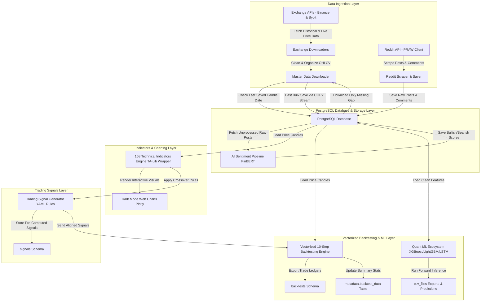

<div id="top"></div>
<div align="center">

# 🚀 CryptoSight: Enterprise Quantitative Data & Technical Analysis Engine

[](https://www.linkedin.com/in/afnanshoukat)
[](https://github.com/21Afnan)
[](https://python.org)
[](https://postgresql.org)
[](https://ta-lib.org)
[](https://plotly.com)

**An institutional, production-grade cryptocurrency data ingestion, dynamic technical analysis, NLP sentiment classification, ML feature engineering, vectorized backtesting, and quantitative analytics framework built for quantitative analysts and financial engineers.**

[🌟 Key Features](#features) • [🏗️ System Flowchart](#flowchart) • [🗄️ Database Architecture](#database) • [🔬 Module Deep Dive](#modules) • [⚡ Quick Start Guide](#quickstart) • [📁 Repository Structure](#structure) • [👨‍💻 Author](#author)

</div>

---

<div id="features"></div>

## 🌟 Executive Summary & 7 Quantitative Pillars

**CryptoSight** bridges the gap between raw exchange data feeds and institutional quantitative strategies. It eliminates boilerplate data cleaning, API pagination headaches, and indicator mapping complexities by providing an end-to-end automated framework organized into **7 Quantitative Pillars**:

| Status | Pillar | Module | High-Level Institutional Functionality |
| :---: | :--- | :--- | :--- |
| 🟢 **LIVE** | **1. Ingestion** | `cryptosight.data` | **Binance & Bybit Ingestion** with smart SQL gap-fill, COPY binary streams, and live candle stripping (`latest_ts` synchronization). |
| ⚡ **FAST** | **2. TA Engine** | `cryptosight.tal_Indicators` | **Dynamic 158 TA-Lib Wrapper** utilizing Python `__getattr__` interception with parameter hierarchy & Plotly visual rendering. |
| 🎯 **RULES** | **3. Signals** | `cryptosight.signals` | **YAML-Driven Signal Pipeline** with multi-crossover conditions and automatic `.shift(1)` look-ahead bias prevention. |
| 🧪 **QUANT** | **4. Backtester** | `cryptosight.backtesting` | **Vectorized 10-Step Backtesting Engine** simulating realistic commissions (`0.05%`), slippage (`0.02%`), dynamic TP/SL, and SQL ledger exports. |
| 🧠 **NLP** | **5. Sentiment** | `cryptosight.sentiment` | **Reddit NLP Pipeline** with PRAW scraping, text cleaning, and **Hugging Face FinBERT** chunk-averaged classification. |
| 🛡️ **CLEAN** | **6. ML Ecosystem** | `cryptosight.ml` | **Quant ML Engine** with lag-free feature extraction (`.shift(1)`), stationarity scaling, XGBoost/LightGBM/LSTM models, and out-of-sample forward inference. |
| 📊 **ANALYTICS**| **7. Evaluation & Stats** | `cryptosight.preprocessing` & `cryptosight.stats` | **QuantStats Analytics & Plotly Engine** computing 59+ financial performance ratios (`CAGR, Sharpe, Sortino, Calmar`) and exporting interactive JSON charts. |


> [!IMPORTANT]
> **Zero Data Leakage Guarantee (`.shift(1)`)**: Every single technical indicator, moving average, and pattern calculated inside CryptoSight is explicitly shifted forward by 1 period (`Bar T -> Bar T+1`) before generating target labels or execution signals. This mathematically prevents future look-ahead bias during historical backtests and ML cross-validation.

<div align="right"><a href="#top">⬆️ Back to Top</a></div>

---

<div id="flowchart"></div>

## 🏗️ System Architecture & Pipeline Flowchart


```mermaid
graph TD
    subgraph Data_Ingestion["Data Ingestion Layer"]
        API["Exchange APIs - Binance & Bybit"] -->|"Fetch Historical & Live Price Data"| Fetcher["Exchange Downloaders"]
        Fetcher -->|"Clean & Organize OHLCV"| Facade["Master Data Downloader"]
        Reddit["Reddit API - PRAW Client"] -->|"Scrape Posts & Comments"| RedditScraper["Reddit Scraper & Saver"]
    end

    subgraph Database_Layer["PostgreSQL Database & Storage Layer"]
        Facade -->|"Check Last Saved Candle Date"| SQL_Check["PostgreSQL Database"]
        SQL_Check -->|"Download Only Missing Gap"| Facade
        Facade -->|"Fast Bulk Save via COPY Stream"| SQL_Check
        
        RedditScraper -->|"Save Raw Posts & Comments"| SQL_Check
        SQL_Check -->|"Fetch Unprocessed Raw Posts"| AI_Sentiment["AI Sentiment Pipeline FinBERT"]
        AI_Sentiment -->|"Save Bullish/Bearish Scores"| SQL_Check
    end

    subgraph Indicators_Layer["Indicators & Charting Layer"]
        SQL_Check -->|"Load Price Candles"| Engine["158 Technical Indicators Engine TA-Lib Wrapper"]
        Engine -->|"Render Interactive Visuals"| Dashboard["Dark Mode Web Charts Plotly"]
    end

    subgraph Signals_Layer["Trading Signals Layer"]
        Engine -->|"Apply Crossover Rules"| Signals["Trading Signal Generator YAML Rules"]
        Signals -->|"Store Pre-Computed Signals"| SQL_Signals["signals Schema"]
    end

    subgraph Backtesting_Layer["Vectorized Backtesting & ML Layer"]
        SQL_Check -->|"Load Price Candles"| Backtester["Vectorized 10-Step Backtesting Engine"]
        Signals -->|"Send Aligned Signals"| Backtester
        Backtester -->|"Export Trade Ledgers"| SQL_Backtests["backtests Schema"]
        Backtester -->|"Update Summary Stats"| SQL_BacktestData["metadata.backtest_data Table"]

        SQL_Check -->|"Load Clean Features"| ML_Engine["Quant ML Ecosystem XGBoost/LightGBM/LSTM"]
        ML_Engine -->|"Run Forward Inference"| ML_Predictions["csv_files Exports & Predictions"]
    end
```

<div align="right"><a href="#top">⬆️ Back to Top</a></div>

---

<div id="database"></div>

## 🗄️ Database Architecture & Schemas

CryptoSight utilizes a highly structured, enterprise **PostgreSQL Database** organized into schemas with strict duplicate prevention and upsert logic:

```text
PostgreSQL Database ('postgres')
├── metadata/                          # System Configuration & Registries
│   ├── market_data                    # Index of downloaded OHLCV candle ranges
│   ├── sentiment_data                 # Index of Reddit sentiment datasets & post counts
│   ├── strategy_data                  # Strategy configurations, indicators, & signal stats
│   └── backtest_data                  # Backtest performance metrics & run configurations
├── signals/                           # Pre-Computed Signal Tables
│   └── <exchange>_<symbol>_<timeframe># Standardized signal data tables per market
└── backtests/                         # Historical Backtest Ledgers
    └── <strategy_name>                # Strategy-specific backtest trade ledger tables
```

### Key Database Design Principles:
1. **High-Performance Binary Streams (`COPY TO/FROM STDOUT`)**:
   - Market candle ingestion and OHLCV queries leverage PostgreSQL C-speed `COPY` streaming, bypassing ORM overhead for ultra-fast multi-gigabyte data loading.
2. **Duplicate Prevention & Conflict Resolution (`DO UPDATE SET`)**:
   - Every signal and backtest ledger table enforces strict primary key constraints on `timestamp` and `entry_time`.
   - Insertion queries utilize `ON CONFLICT DO UPDATE SET ...` to safely overwrite and update existing rows without creating duplicate records.

<div align="right"><a href="#top">⬆️ Back to Top</a></div>

---

<div id="modules"></div>

## 🔬 Module Deep Dive

### 1️⃣ **Exchange Data Ingestion (`cryptosight.data`)**
- **Gap-Filling Algorithm**: Queries PostgreSQL for the latest downloaded candle timestamp (`SELECT MAX(timestamp)`). Only missing candles are fetched via paginated API requests.
- **Unclosed Bar Protection**: Strips the current live/unclosed candle before database insertion to prevent storing incomplete OHLCV bars.
- **Bulk COPY Insertion**: Utilizes PostgreSQL binary `COPY` streams for high-speed multi-year OHLCV storage.

### 2️⃣ **Technical Analysis Engine (`cryptosight.tal_Indicators`)**
- **Dynamic Interception**: Uses Python `__getattr__` dynamic method dispatch to wrap all **158 TA-Lib indicators** seamlessly.
- **Category Coverage**: Overlap Studies, Momentum Indicators, Volume Indicators, Volatility Indicators, Price Transform, Cycle Indicators, and Pattern Recognition.

### 3️⃣ **Trading Signals Engine (`cryptosight.signals`)**
- **YAML Rule Engine**: Configures multi-indicator condition sets and crossover rules in `strategy_config.yaml`.
- **Look-Ahead Bias Prevention**: Enforces `.shift(1)` across indicator matrices before evaluating signal conditions.
- **Persistence Windows**: Supports multi-bar persistence windows to confirm breakouts across timeframes.

### 4️⃣ **Vectorized Backtesting Engine (`cryptosight.backtesting`)**
- **10-Step Execution Simulation**: Models entry fill, commissions (`0.05%`), slippage (`0.02%`), take-profit percentage, stop-loss percentage, and trailing stops.
- **Ledger Generation**: Exports trade logs into CSV and database tables with exact PnL and return percentages.

### 5️⃣ **NLP Sentiment Engine (`cryptosight.sentiment`)**
- **Reddit PRAW Scraper**: Automated scraper pulling posts and top comments from target cryptocurrency subreddits.
- **Text Cleaning Engine**: Strips HTML tags, contracts, URLs, and bot-generated boilerplate text.
- **FinBERT Classification**: Uses Hugging Face **FinBERT** (`yiyanghkust/finbert-tone`) with chunk-averaging to calculate Bullish, Bearish, and Neutral probabilities.

### 6️⃣ **Machine Learning Ecosystem (`cryptosight.ml`)**
- **Feature Builder**: Generates stationarity-transformed features, log returns (`np.log`), and 3-class target matrices (`Long`, `Short`, `Hold`).
- **Chronological Splitter**: Enforces chronological train/validation/test splits to avoid temporal leakage.
- **Multi-Model Suite**: Trains XGBoost, LightGBM, Random Forest, and PyTorch LSTM models.
- **Out-of-Sample Inference**: Standalone forward-inference engine (`inference_pipeline.py`) running real-time signal predictions.

### 7️⃣ **Preprocessing & Quant Analytics (`cryptosight.preprocessing` & `cryptosight.stats`)**
- **Stationarity Testing**: Automated Augmented Dickey-Fuller (ADF) and KPSS stationarity tests.
- **6-Scaler Benchmark**: Benchmarks signals across `RobustScaler`, `MinMaxScaler`, `Fractional Differentiation (FracDiff)`, `Winsorization`, `Log Transformation`, and `Gaussian Normalization`.
- **QuantStats Integration**: Calculates 59+ institutional performance ratios (Sharpe, Sortino, Calmar, Max Drawdown, CAGR, Win Rate).
- **Plotly Visuals**: Exports dark-mode interactive HTML/JSON charts for web dashboard rendering.

<div align="right"><a href="#top">⬆️ Back to Top</a></div>

---

<div id="quickstart"></div>

## ⚡ Quick Start Guide & Running Pipelines

### 1️⃣ **Environment Setup**
Clone the repository and set up your Python environment:
```bash
# Clone repository
git clone https://github.com/21Afnan/cryptosight.git
cd cryptosight

# Create and activate virtual environment
python -m venv venv
venv\Scripts\activate.bat

# Install dependencies
pip install -r requirements.txt
```

### 2️⃣ **Running Data Ingestion & Market Downloads**
```bash
# Download Binance Market Data
python -m cryptosight.data.binance.main

# Download Bybit Market Data
python -m cryptosight.data.bybit.main
```

### 3️⃣ **Running Signal Generation & Backtesting**
```bash
# Run Signals Pipeline
python -m cryptosight.signals.main

# Run Vectorized Backtest Engine
python -m cryptosight.backtesting.backtest
```

### 4️⃣ **Running ML Training & Inference**
```bash
# Run Machine Learning Pipeline
python -m cryptosight.ml.main
```

<div align="right"><a href="#top">⬆️ Back to Top</a></div>

---

<div id="structure"></div>

## 📁 Complete Repository Structure

```text
cryptosight/
├── data/                          # Exchange downloaders with smart SQL gap fill & live bar protection
│   ├── downloader.py              # Master Downloader class with SQL COPY stream & resampling
│   ├── binance/                   # Binance API fetcher, config.yaml, main.py & run_binance.bat
│   └── bybit/                     # Bybit API fetcher, config.yaml, main.py & run_bybit.bat
├── tal_Indicators/                # Dynamic __getattr__ wrapper for all 158 TA-Lib technical indicators
├── signals/                       # YAML/DB-driven quant signal generator & multi-crossover rule engine
├── backtesting/                   # Vectorized 10-step backtester modeling commissions, slippage & SQL ledger
├── sentiment/                     # PRAW Reddit scraper, text cleaning engine & Hugging Face FinBERT classifier
├── ml/                            # Comprehensive end-to-end Machine Learning ecosystem
│   ├── main.py                    # Master orchestrator for feature generation, chron-splitting & inference
│   ├── ml_config.yaml             # Centralized YAML spec for features, models, splits & signal thresholds
│   ├── preprocessing/             # Robust in-memory QuantPreprocessors and MLFeatureBuilders
│   ├── models/                    # Modular training pipelines (XGBoost, LightGBM, Random Forest, PyTorch LSTM)
│   ├── inference/                 # Standalone out-of-sample forward-inference engine (inference_pipeline.py)
│   └── evaluation/                # Master JSON report builders linking hyperparameters to evaluation metrics
├── preprocessing/                 # Preprocessing benchmark suite & multi-model evaluation leaderboard
├── stats/                         # Institutional statistical analytics & frontend charts suite (QuantStats + Plotly)
├── frontend/                      # React / Vite quantitative dashboard interface
├── csv_files/                     # Automated export directory for predictions, reports & master tables
├── logs/                          # Rotating execution logs with SafeRotatingFileHandler
├── utils/                         # Shared utilities (db.py PostgreSQL pool, metadata.py schema managers, logger.py)
├── .env                           # Database & API credentials (git-ignored)
├── README.md                      # Comprehensive enterprise documentation
└── requirements.txt               # Python package dependencies
```

<div align="right"><a href="#top">⬆️ Back to Top</a></div>

---

<div id="author"></div>
<div align="center">

## 👨‍💻 Built & Engineered by Afnan Shoukat

**Full-Stack Quantitative Engineer • Financial Data Scientist • Algorithmic Systems Architect**

[](https://www.linkedin.com/in/afnanshoukat)
[](https://github.com/21Afnan)

*Designed with enterprise precision, zero data leakage, and institutional quantitative rigor.*

© 2026 CryptoSight. All rights reserved.

</div>
