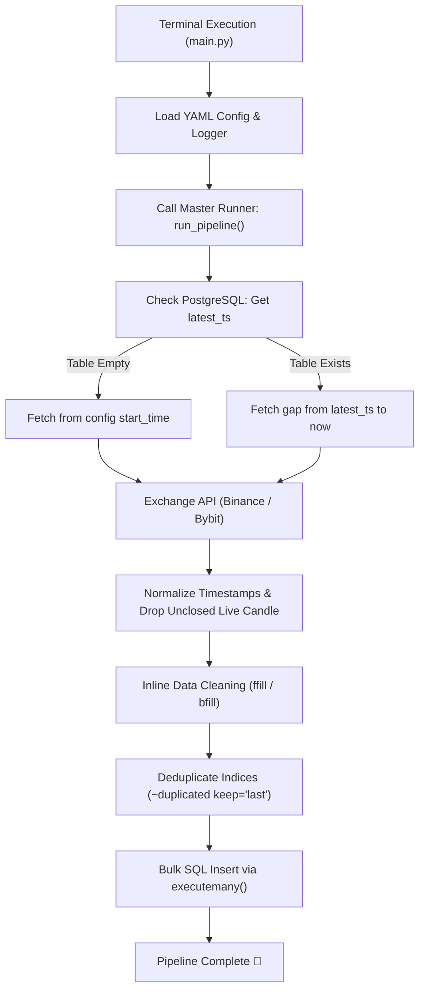

# 🚀 CryptoSight Data Ingestion Pipeline

**CryptoSight** is a state-of-the-art, fully automated cryptocurrency data ingestion engine. It seamlessly fetches historical and real-time OHLCV (Open, High, Low, Close, Volume) candlestick data from top exchanges (**Binance** and **Bybit**) and saves it directly into a **PostgreSQL database** in a clean, timezone-independent UTC format.

Designed for quantitative analysis and algorithmic trading pipelines, CryptoSight features smart gap detection, live active candle filtering, inline missing data filling (`ffill`/`bfill`), and on-the-fly multi-timeframe resampling.

---

## ✨ Key Features

- **🔄 Smart Gap Ingestion**: Automatically checks PostgreSQL for the latest stored timestamp (`latest_ts`) and downloads *only* the missing gap up to `now`. Zero redundant fetching.
- **⚡ Unified Master Pipeline**: A clean facade pattern (`run_pipeline`) where initializing the orchestrator, downloading data, merging gaps, or resampling is controlled via a single function call.
- **🛡️ Live Candle Protection**: Safely detects and drops unclosed active live candles (e.g., the current 1-minute candle in progress) when fetching up to `"now"`, ensuring only finalized candles are written to SQL.
- **📦 Multi-Exchange Support**: Built-in specialized clients for **Binance** and **Bybit** (including forward chunk pagination for large Bybit historical queries).
- **⏱️ Intelligent Timeframe Translation**: Bridges cryptocurrency minute notation (`1m`, `5m`, `15m`) with Pandas time-series rules (`1min`, `5min`), preventing common aggregation errors.
- **🌐 Strict UTC Timezone Enforcement**: All timestamps are standardized and stored in timezone-naive UTC format (`TIMESTAMP`), avoiding daylight saving shifts or database timezone mismatches.

---

## 📁 Repository Structure

```text
cryptosight/
├── data/
│   ├── binance/
│   │   ├── binance_client.py      # Binance API fetcher with automatic retry & timestamp normalization
│   │   ├── config.yaml            # YAML settings (symbols, timeframe, date ranges, retry rules)
│   │   └── main.py                # Single-call execution script for Binance ingestion
│   ├── bybit/
│   │   ├── bybit_client.py        # Bybit API fetcher with forward chunk pagination loop
│   │   ├── config.yaml            # YAML settings for Bybit ingestion
│   │   └── main.py                # Single-call execution script for Bybit ingestion
│   └── downloader.py              # Master orchestrator (run_pipeline, download, get_data, resample)
├── logs/
│   ├── binance.log                # Rotating log file for Binance execution
│   ├── bybit.log                  # Rotating log file for Bybit execution
│   └── db.log                     # Database connection and query execution logs
├── utils/
│   ├── config.py                  # YAML loader and timestamp normalization utility
│   ├── db.py                      # PostgreSQL schema, table creation, and bulk executemany loader
│   └── logger.py                  # Rotating file and console logger configuration
├── .env                           # Database environment variables (git-ignored)
├── requirements.txt               # Python package dependencies
└── README.md                      # Project documentation
```

---

## ⚙️ Architecture & Data Flow

The following diagram illustrates the complete execution lifecycle when running an ingestion pipeline:


```mermaid
graph TD
    User["Terminal Execution (main.py)"] --> Config["Load YAML Config & Logger"]
    Config --> Runner["Call Master Runner: run_pipeline()"]
    Runner --> DB_Check["Check PostgreSQL: Get latest_ts"]
    
    DB_Check -->|Table Empty| Fetch_Start["Fetch from config start_time"]
    DB_Check -->|Table Exists| Fetch_Gap["Fetch gap from latest_ts to now"]
    
    Fetch_Start --> API["Exchange API (Binance / Bybit)"]
    Fetch_Gap --> API
    
    API --> Clean["Normalize Timestamps & Drop Unclosed Live Candle"]
    Clean --> Fill["Inline Data Cleaning (ffill / bfill)"]
    Fill --> Dedupe["Deduplicate Indices (~duplicated keep='last')"]
    Dedupe --> Save["Bulk SQL Insert via executemany()"]
    Save --> Success["Pipeline Complete 🚀"]
```

---

## 🛠️ Setup & Installation

### 1. Requirements & Virtual Environment
Ensure you have **Python 3.10+** and **PostgreSQL** installed.

```bash
# Create and activate virtual environment
python -m venv venv
venv\Scripts\activate  # On Windows PowerShell

# Install required dependencies
pip install -r requirements.txt
```

### 2. Database Configuration (`.env`)
Create a `.env` file inside the root workspace directory containing your PostgreSQL credentials:

```env
DB_HOST=localhost
DB_PORT=5432
DB_NAME=postgres
DB_USER=postgres
DB_PASSWORD=your_password
```

### 3. Customize Ingestion Settings
Edit [data/binance/config.yaml](file:///d:/Neurog_Internship/cryptosight/data/binance/config.yaml) or [data/bybit/config.yaml](file:///d:/Neurog_Internship/cryptosight/data/bybit/config.yaml):

```yaml
exchange: "binance"          # Options: "binance" or "bybit"
symbols:
  - "BTC"
  - "ADA"
timeframe: "1m"              # Interval options: "1m", "5m", "15m", "1h", "1d"
start_time: "2026-06-22 00:00:00"
end_time: "now"              # "now" fetches up to real-time current minute
fill_method: "ffill"         # "ffill" (Forward Fill) fills small market gaps
max_retries: 5
retry_delay: 3
```

---

## 🚀 Running the Pipeline

Thanks to built-in dynamic path resolution, you can execute the pipeline seamlessly from **any** working directory:

### Run Binance Ingestion:
```powershell
# Run directly from root directory
python data/binance/main.py

# Or navigate inside the folder and run
cd data\binance
python main.py
```

### Run Bybit Ingestion:
```powershell
# Run directly from root directory
python data/bybit/main.py

# Or navigate inside the folder and run
cd data\bybit
python main.py
```

---

## 🔬 Advanced Usage (Python API)

Beyond scheduled SQL ingestion, `Downloader` exposes powerful methods for quantitative analysis and backtesting directly in Python RAM:

### 1. In-Memory Gap Fetching (`get_data`)
Load historical candles from PostgreSQL and merge them with live exchange gap data *without* writing new records back to the SQL table:

```python
from cryptosight.data.downloader import Downloader

dl = Downloader(exchange="binance", symbol="btc", timeframe="1m")

# Returns a complete Pandas DataFrame combined from DB + Live API
df = dl.get_data(
    start_time="2026-06-22 00:00:00",
    end_time="now",
    max_retries=3,
    retry_delay=2
)
print(f"Loaded {len(df)} candles!")
print(df.tail(3))
```

### 2. On-the-Fly Timeframe Resampling (`resample`)
Instantly convert lower-timeframe data (e.g., `1m` candles) into clean higher-timeframe aggregations (e.g., `5m`, `15m`, or `4h`):

```python
from cryptosight.data.downloader import Downloader

dl = Downloader(exchange="bybit", symbol="btc", timeframe="1m")

# Automatically handles minute conversions ('5m' -> '5min')
original_1m_df, resampled_5m_df = dl.resample(
    target_timeframe="5m",
    start_time="2026-06-22 00:00:00",
    end_time="now",
    max_retries=3,
    retry_delay=2
)

print("First 3 Resampled 5-Minute Candles:")
print(resampled_5m_df.head(3))
```
