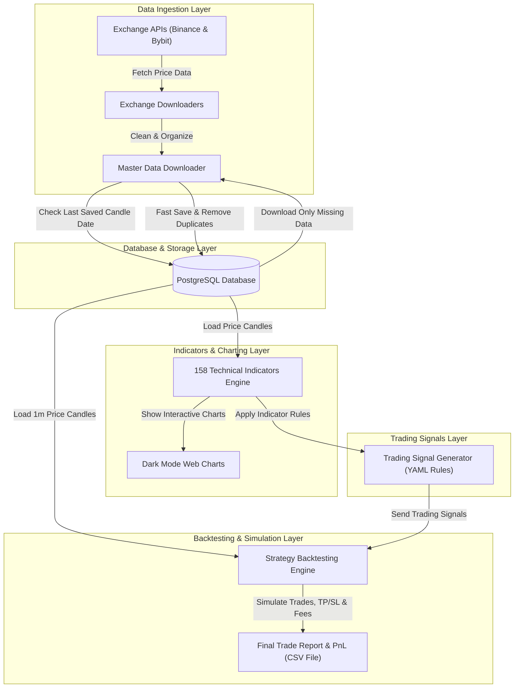

# 🚀 CryptoSight: Enterprise Quantitative Data & Technical Analysis Engine

<div align="center">


**An automated, production-grade cryptocurrency data ingestion, dynamic technical analysis, and signal generation framework built for quantitative analysts, algorithmic traders, and financial engineers.**

</div>

---

## 🌟 Executive Summary

**CryptoSight** bridges the gap between raw cryptocurrency market data feeds and institutional-grade quantitative strategies. It eliminates boilerplate data cleaning, API pagination headaches, and indicator mapping complexities by providing an end-to-end automated framework:

1. **Automated Data Ingestion**: Seamlessly connects to **Binance** and **Bybit**, fetching historical and real-time OHLCV (Open, High, Low, Close, Volume) data with smart gap detection against a **PostgreSQL** database.
2. **Dynamic 158 TA-Lib Engine**: Harnesses Python magic methods to wrap all 158 TA-Lib technical indicators dynamically, supported by an institutional parameter hierarchy and interactive multi-panel Plotly charting.
3. **YAML-Driven Quantitative Signal Pipeline**: Evaluates multi-indicator crossover conditions, tracks look-back persistence windows, and generates leak-free long/short trading signals automatically.
4. **Vectorized 10-Step Backtesting Engine**: Executes ultra-fast historical simulations with realistic market friction modeling (broker commissions, price slippage), dynamic position sizing, automated Take-Profit/Stop-Loss scanning, and cumulative trade ledger accounting.

---

## 🏗️ How It Was Built: Core Architectural Principles

CryptoSight was engineered with reliability, data integrity, and zero-redundancy in mind. Instead of writing ad-hoc scripts, the system is organized into modular architectural layers:


```mermaid
graph TD
    subgraph Data Ingestion Layer
        API["Exchange APIs (Binance & Bybit)"] -->|Fetch Price Data| Fetcher["Exchange Downloaders"]
        Fetcher -->|Clean & Organize| Facade["Master Data Downloader"]
    end

    subgraph Database & Storage Layer
        Facade -->|Check Last Saved Candle Date| SQL_Check[("PostgreSQL Database")]
        SQL_Check -->|Download Only Missing Data| Facade
        Facade -->|Fast Save & Remove Duplicates| SQL_Check
    end

    subgraph Indicators & Charting Layer
        SQL_Check -->|Load Price Candles| Engine["158 Technical Indicators Engine"]
        Engine -->|Show Interactive Charts| Dashboard["Dark Mode Web Charts"]
    end

    subgraph Trading Signals Layer
        Engine -->|Apply Indicator Rules| Signals["Trading Signal Generator (YAML Rules)"]
    end

    subgraph Backtesting & Simulation Layer
        SQL_Check -->|Load 1m Price Candles| Backtester["Strategy Backtesting Engine"]
        Signals -->|Send Trading Signals| Backtester
        Backtester -->|Simulate Trades, TP/SL & Fees| Ledger["Final Trade Report & PnL (CSV File)"]
    end
```

### 🧠 1. Smart Gap Ingestion & Zero-Redundancy Storage
When running routine data updates, re-downloading entire historical datasets is inefficient and risks exchange rate-limits. CryptoSight solves this via **Smart Gap Detection**:
- The pipeline queries PostgreSQL for the exact timestamp of the last stored candle (`latest_ts`).
- It computes the precise delta between `latest_ts` and current time, instructing the exchange client to download **only the missing gap**.
- Employs high-speed PostgreSQL bulk insertion into staging tables with automated deduplication to guarantee database integrity.

### 🛡️ 2. Live Candle Protection & Timestamp Normalization
Cryptocurrency exchanges often stream unclosed, currently active candles (e.g., a 1-hour candle that is only 15 minutes old). Writing incomplete bars corrupts technical analysis indicators. CryptoSight automatically inspects the latest bar's timestamp and strips out active live candles, ensuring **only fully finalized candles** enter your permanent SQL storage. All timestamps are standardized to UTC milliseconds.

### 🔮 3. Dynamic "Magic" TA-Lib Wrapper
Instead of hardcoding functions for 158 different indicators, CryptoSight utilizes Python's dynamic object interception. When an indicator method is called on the wrapper class, the engine intercepts the call, consults a rich institutional catalog, maps column schemas, resolves parameter defaults, and executes C-compiled TA-Lib operations in microseconds.

### ⚡ 4. Look-Ahead Bias-Free Signal Generation
The quantitative signal engine evaluates trading rules defined in human-readable YAML configuration files. To ensure realistic backtesting and live trading execution:
- Conditions (such as moving average crossovers or RSI thresholds) are evaluated across configurable persistence windows.
- Generated signals are automatically **shifted by 1 bar** so that a signal triggered by the close of Bar $T$ is executed at the open of Bar $T+1$.

### 📈 5. Vectorized Backtesting & Realistic Friction Modeling
To validate strategies before deployment, CryptoSight features a custom vectorized 10-step backtesting engine (`backtesting/backtest.py`):
- **High-Speed Ingestion**: Pulls 1-minute OHLCV candles via PostgreSQL's fast `COPY` stream.
- **Execution Pricing**: Models trade entries and exits at `next_open` or `current_close` to prevent look-ahead bias.
- **Dynamic Risk & Order Management**: Automatically calculates position sizes based on capital percentages and vector-scans future candle highs/lows to detect Take-Profit (TP) and Stop-Loss (SL) triggers.
- **Market Friction Modeling**: Incorporates broker commissions and execution slippage on both entry and exit legs, calculating accurate Gross PnL, Net PnL, and running account balances.

---

## 📁 Complete Repository Structure & Guide

```text
cryptosight/
├── data/
│   ├── binance/
│   │   ├── binance_client.py      # Binance API fetcher with automatic retry & timestamp normalization
│   │   ├── config.yaml            # YAML settings (symbols, timeframe, date ranges, retry rules)
│   │   ├── main.py                # Single-call execution script for Binance ingestion
│   │   └── run_binance.bat        # One-click Windows runner script for automated ingestion
│   ├── bybit/
│   │   ├── bybit_client.py        # Bybit API fetcher with forward chunk pagination loop
│   │   ├── config.yaml            # YAML settings for Bybit ingestion
│   │   ├── main.py                # Single-call execution script for Bybit ingestion
│   │   └── run_bybit.bat          # One-click Windows runner script for automated ingestion
│   └── downloader.py              # Master orchestrator (run_pipeline, download, get_data, resample)
├── tal_Indicators/
│   ├── tal_ind_con.py             # Institutional catalog of 158 TA-Lib indicators & schema definitions
│   └── indicators.py              # Dynamic Indicators class wrapper & Plotly master dashboard engine
├── signals/
│   ├── strategy_config.yaml       # Quantitative strategy definitions (indicators, operators, and rules)
│   ├── conditions.py              # Evaluates multi-bar condition persistence windows
│   ├── rules.py                   # Generates integer trading signals (+1 Long, -1 Short, 0 Neutral)
│   └── main.py                    # Master execution pipeline running indicators -> conditions -> signals
├── backtesting/
│   ├── backtest.py                # Vectorized 10-step quantitative strategy backtesting engine
│   ├── backt_config.yaml          # YAML settings for market selection, position sizing, fees & TP/SL
│   └── backtest_ledger.csv        # Automated trade ledger output with detailed PnL accounting
├── logs/
│   ├── binance.log                # Rotating log file tracking Binance API execution
│   ├── bybit.log                  # Rotating log file tracking Bybit API execution
│   └── db.log                     # Database connection and SQL query execution logs
├── utils/
│   ├── config.py                  # YAML loader and timestamp normalization utility
│   ├── db.py                      # PostgreSQL schema, table creation, and bulk COPY loader
│   └── logger.py                  # Rotating file and console logger configuration
├── .env                           # Database environment variables (git-ignored)
├── requirements.txt               # Python package dependencies
└── README.md                      # Complete project documentation and operation guide
```

---

## 🛠️ Step-by-Step Guide: How to Run & Operate the Application

CryptoSight is designed for seamless operation. You do not need to write code or scripts to run data ingestion, generate quantitative signals, or view interactive charts. Everything is controlled through simple configuration files and pre-built runners.

### Step 1: Initial Environment Preparation

1. **Virtual Environment**: Ensure Python 3.10+ is installed. Activate your project virtual environment from your system terminal or file explorer.
2. **Dependencies**: Install the required packages listed in the project requirements file (includes database adapters, technical analysis libraries, and visualization suites).

---

### Step 2: Database Configuration

Create a simple text file named `.env` inside the root workspace folder containing your PostgreSQL database connection details:
- **Host**: Your local database address (usually localhost)
- **Port**: Standard PostgreSQL port (5432)
- **Name**: Your target database name
- **User & Password**: Your secure database credentials

*Note: The system automatically detects missing tables on first run and builds optimal database structures and indices without any manual intervention.*

---

### Step 3: Running Market Data Ingestion

You can configure which coin pairs to download (e.g., Bitcoin or Ethereum), the candlestick timeframe, and historical date ranges simply by opening the configuration files (`data/binance/config.yaml` or `data/bybit/config.yaml`) in any text editor.

| Execution Method | How to Run | Best For |
| :--- | :--- | :--- |
| **Option A: One-Click Windows Execution** | Simply navigate to the exchange folder inside your file explorer and **double-click** the pre-built batch file (`run_binance.bat` or `run_bybit.bat`). | Instant manual data updates without opening a terminal window. |
| **Option B: Terminal Execution** | Run the exchange main module directly using your environment runner. | Developers and analysts executing pipelines within interactive terminal sessions. |
| **Option C: 24/7 Automated Background Sync** | Open **Windows Task Scheduler**, create a hidden background task pointing to the batch file (`run_binance.bat`), and set the trigger to run **every 5 minutes**. | Hands-free, continuous live database synchronization. |

---

### Step 4: Generating Quantitative Trading Signals

The quantitative signal module automatically loads synchronized market data from your database, calculates technical indicators, evaluates strategy rules, and generates trading signals.

1. **Configure Your Strategy**: Open `signals/strategy_config.yaml` in any text editor to view or adjust moving average periods, RSI overbought/oversold boundaries, or logical combination rules.
2. **Execute the Signal Pipeline**: Run the signals execution module (`signals/main.py`). The pipeline automatically handles parameter resolution and processes the entire dataset.
3. **Review Results**: The system outputs a clean summary directly to your console and automatically generates a comprehensive CSV report containing the full historical price action alongside calculated indicators and active long/short trading signals inside the `signals/` directory (`signals_pipeline_output.csv`).

---

### Step 5: Running Quantitative Backtests & Performance Simulation

Once your trading signals are generated, use the **Vectorized Backtesting Engine** to simulate historical trading performance with institutional accuracy:

1. **Configure Simulation Parameters**: Open `backtesting/backt_config.yaml` to set your target exchange, coin symbol, date ranges, starting account balance (e.g., `$10,000`), position sizing percentage, and Take-Profit/Stop-Loss boundaries.
2. **Execute the Backtest Engine**: Run `backtesting/backtest.py` from your terminal:
   ```bash
   python -m cryptosight.backtesting.backtest
   ```
3. **Review Audit Ledger & PnL Metrics**: The engine prints an instant performance showcase to your console (Total Trades, Final Balance, Net Profit) and exports a comprehensive trade ledger to `backtesting/backtest_ledger.csv`. Each trade entry records execution prices, exact TP/SL exit triggers, broker commissions, slippage friction, and running account balances.

---

### Step 6: Rendering Interactive Visual Dashboards

When performing exploratory research or reviewing strategy performance, CryptoSight provides a built-in visualizer that renders multi-panel, dark-mode interactive charts directly in your web browser:

1. Pass your loaded dataset into the dynamic indicators wrapper.
2. Compute any required technical indicators dynamically by calling their names.
3. Call the master dashboard plotting function to instantly launch an interactive visual suite featuring synchronized zooming, panning, and multi-panel indicator overlays.

> **💡 Institutional Tip**: When analyzing large datasets with hundreds of thousands of candles, slice your data to the most recent 1,000 to 2,000 bars prior to visualization to ensure lightning-fast browser performance and smooth UI interaction.

---

<div align="center">
<b>CryptoSight</b> — Built for Quantitative Precision & High-Performance Data Engineering.
</div>
