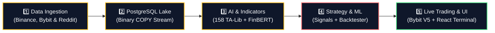
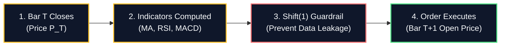
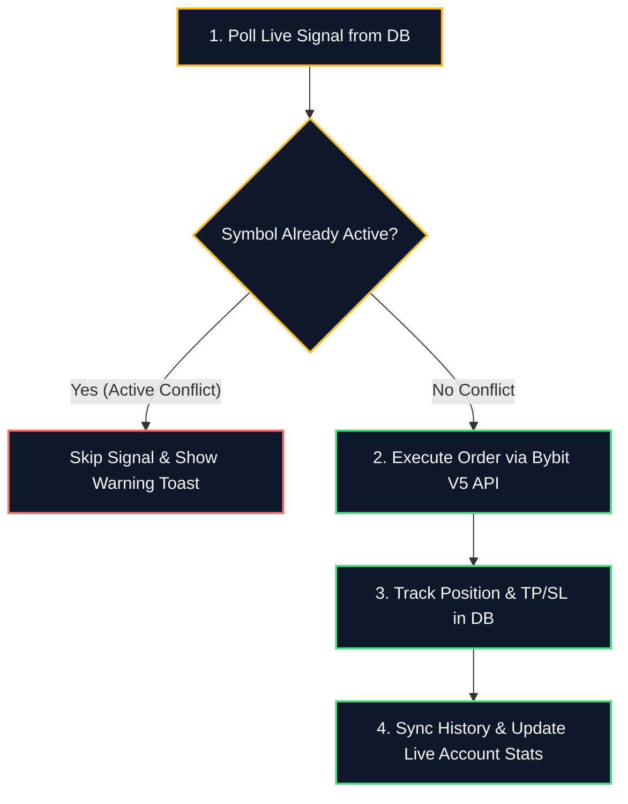
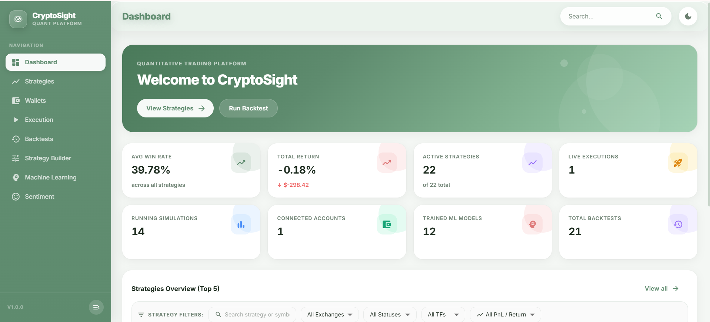
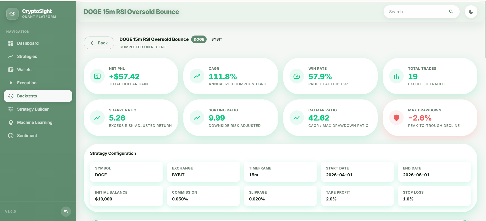
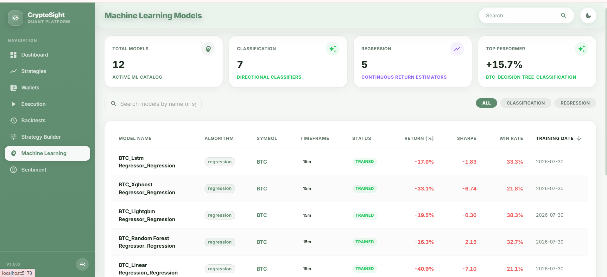
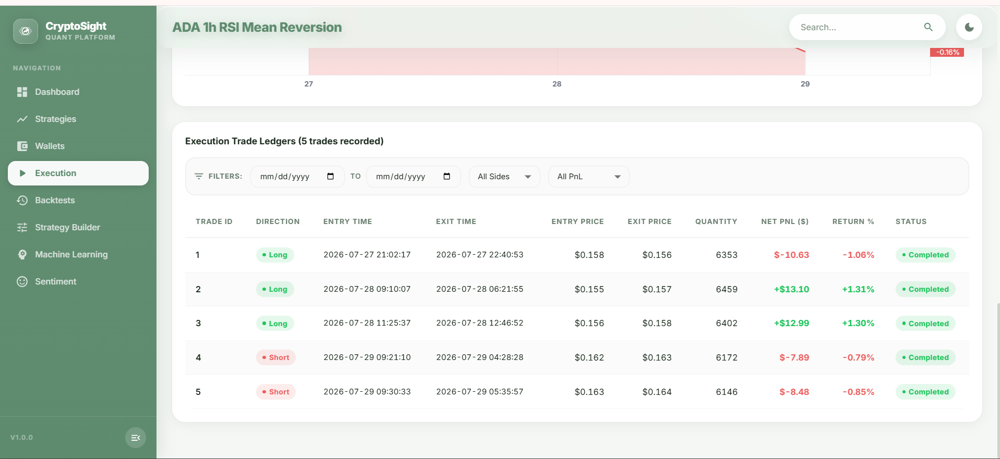
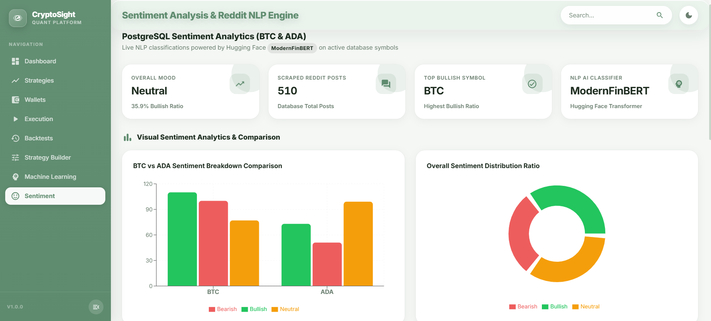
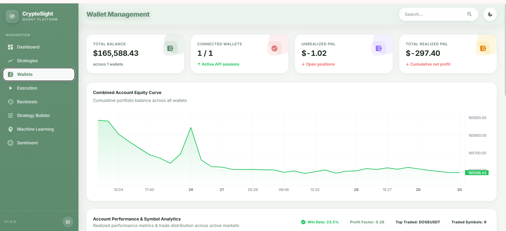

<div id="top"></div>
<div align="center">

# ⚡ CryptoSight: Institutional Quantitative Trading Terminal & Algorithmic Engine

> **Enterprise Financial Data Ingestion, 158 Dynamic Technical Indicators, Zero-Leakage ML Signal Generation, FinBERT NLP Sentiment Analysis, Vectorized Backtesting, Bybit V5 Automated Live Execution & Real-Time React Dashboard.**

[](https://www.linkedin.com/in/afnanshoukat)
[](https://neurog.ai)
[](https://github.com/21Afnan)
[](mailto:afnanshoukat21@gmail.com)
[](https://python.org)
[](https://fastapi.tiangolo.com)
[](https://reactjs.org)
[](https://postgresql.org)

</div>

---

## 🌟 Executive Summary & 10 Quantitative Pillars

**CryptoSight** bridges the gap between raw cryptocurrency exchange feeds and institutional quantitative strategies. It eliminates manual data cleaning, API pagination headaches, and indicator mapping complexities by unifying financial data engineering into **10 Quantitative Pillars**:

```
 ┌─────────────────────────────────────────────────────────────────────────────────────────┐
 │                                 CRYPTOSIGHT QUANT ENGINE                                │
 ├──────────────┬──────────────┬──────────────┬──────────────┬──────────────┬──────────────┤
 │  INGESTION   │  TA ENGINE   │   SIGNALS    │  SIMULATOR   │  BACKTESTER  │  SENTIMENT   │
 │  Binance/    │  158 TA-Lib  │ YAML Logic & │ Event-Driven │  Vectorized  │ FinBERT NLP  │
 │  Bybit Streams │  Interception│ Shift(1) Guard│ Active Pos   │ 10-Step Engine│ Reddit Scrape│
 ├──────────────┼──────────────┼──────────────┼──────────────┼──────────────┴──────────────┤
 │  ML ENGINE   │  ANALYTICS   │   TERMINAL   │ LIVE EXECUTE │  DATA INTEGRITY POLICY      │
 │ PyTorch/XGB  │ 59+ Ratios   │ React 18 UI  │  Bybit V5    │ Zero-Fake-Data & Fail-Safe   │
 └──────────────┴──────────────┴──────────────┴──────────────┴─────────────────────────────┘
```

### 🏛️ The 10 Quantitative Pillars Breakdown

| Status | Pillar | Core Module | Institutional Functionality |
| :---: | :--- | :--- | :--- |
| 🟢 **DONE** | **1. Data Ingestion** | `cryptosight.data` | Multi-exchange OHLCV downloader with smart PostgreSQL gap-filling, `COPY` binary streaming, and live candle stripping (`latest_ts` sync). |
| 🟢 **DONE** | **2. Technical Analysis** | `cryptosight.tal_Indicators` | Dynamic **158 TA-Lib Indicator Wrapper** utilizing Python `__getattr__` interception with parameter hierarchy & Plotly rendering. |
| 🟢 **DONE** | **3. Signal Generation** | `cryptosight.signals` | Declarative YAML-driven rules engine with multi-indicator crossovers and mandatory `.shift(1)` look-ahead bias prevention. |
| 🟢 **DONE** | **4. Event Simulator** | `cryptosight.simulator` | Bar-by-bar execution engine maintaining live active positions (`simulations.active_positions`), trade ledgers, and dynamic PnL metrics. |
| 🟢 **DONE** | **5. Vectorized Backtester**| `cryptosight.backtesting` | 10-Step vectorized engine simulating taker/maker fees (`0.05%`), slippage (`0.02%`), dynamic TP/SL, and exporting trade ledgers to DB. |
| 🟢 **DONE** | **6. NLP Sentiment** | `cryptosight.sentiment` | PRAW Reddit scraper & **Hugging Face FinBERT** chunk-averaged transformer for real-time market sentiment classification. |
| 🟢 **DONE** | **7. ML Ecosystem** | `cryptosight.ml` | Stationarity-scaled feature engineering, XGBoost, LightGBM, Random Forest & PyTorch LSTM models with forward inference. |
| 🟢 **DONE** | **8. Quant Analytics** | `cryptosight.stats` | **QuantStats Suite** computing 59+ institutional performance ratios (Sharpe, Sortino, Calmar, Tail Ratio, Expectancy, Max Drawdown). |
| 🟢 **DONE** | **9. Trading Terminal** | `backend` & `frontend` | **FastAPI REST API + React 18 Dashboard** with Lightweight Charts v5, equal-height card layouts, and strict financial data governance. |
| 🟢 **DONE** | **10. Automated Execution** | `cryptosight.execution` | Automated Bybit UTA V5 live execution engine with position tracking (`execution.active_positions`), account history sync, and symbol guardrails. |

<div align="right"><a href="#top">⬆️ Back to Top</a></div>

---

## 📁 Repository Structure

```text
cryptosight/
├── backend/                       # FastAPI REST API backend services & routers
│   ├── main.py                    # Application entry point & CORS configuration
│   ├── routers/                   # APIRouters (dashboard, strategy, backtest, wallet, ml)
│   └── services/                  # SQL query builders, calculation services & fallback handlers
├── data/                          # Data ingestion engine with SQL gap-filling
│   ├── downloader.py              # Master Downloader with PostgreSQL COPY streaming
│   ├── binance/                   # Binance REST fetcher & main runner
│   └── bybit/                     # Bybit REST fetcher & main runner
├── execution/                     # Bybit UTA V5 Automated Live Execution Engine
│   ├── engine.py                  # Master live execution loop & position reconciler
│   ├── bybit_executor.py          # Bybit V5 REST API executor & order manager
│   ├── account_stats.py           # Account performance statistics calculator
│   └── main.py                    # Live execution entry point
├── tal_Indicators/                # Dynamic __getattr__ wrapper for 158 TA-Lib indicators
├── signals/                       # Declarative YAML quant signal generator
├── simulator/                     # Bar-by-bar event-driven simulation engine
├── backtesting/                   # Vectorized 10-step backtester with commission & slippage
├── sentiment/                     # PRAW Reddit scraper & Hugging Face FinBERT NLP model
├── ml/                            # End-to-end Machine Learning ecosystem (XGBoost/LightGBM/LSTM)
│   ├── artifacts/                 # Saved model weights (.joblib, .pt) & configs
│   ├── evaluation/                # Classification & regression evaluators
│   ├── preprocessing/             # Feature builders & stationarity scaling
│   └── main.py                    # ML pipeline orchestrator
├── stats/                         # QuantStats institutional analytics & chart generators
├── frontend/                      # React 18 / Vite trading terminal interface
│   ├── src/                       # Components, lightweight charts, pages, theme system
│   └── package.json               # Frontend dependencies
├── docs/                          # System architecture diagrams & dashboard screenshots
├── logs/                          # System execution logs
├── utils/                         # Database pool (db.py), logger, metadata schema managers
├── README.md                      # Enterprise system documentation
└── requirements.txt               # Python package dependencies
```

<div align="right"><a href="#top">⬆️ Back to Top</a></div>

---

## 🏗️ System Architecture & Pipeline Flowcharts

### 1. Simple 5-Step System Pipeline


```mermaid
flowchart LR
    A["1️⃣ Data Ingestion\n(Binance, Bybit & Reddit)"] --> B["2️⃣ PostgreSQL Lake\n(Binary COPY Stream)"]
    B --> C["3️⃣ AI & Indicators\n(158 TA-Lib + FinBERT)"]
    C --> D["4️⃣ Strategy & ML\n(Signals + Backtester)"]
    D --> E["5️⃣ Live Trading & UI\n(Bybit V5 + React Terminal)"]

    classDef neutral fill:#0f172a,stroke:#fbbf24,stroke-width:2px,color:#f8fafc;
    classDef warning fill:#0f172a,stroke:#f87171,stroke-width:2px,color:#f8fafc;
    classDef success fill:#0f172a,stroke:#4ade80,stroke-width:2px,color:#f8fafc;

    class A,B,C neutral;
    class D warning;
    class E success;
```

---

### 2. Simple Zero Look-Ahead Bias Flow


```mermaid
flowchart LR
    A["1. Bar T Closes\n(Price P_T)"] --> B["2. Indicators Computed\n(MA, RSI, MACD)"]
    B --> C["3. Shift(1) Guardrail\n(Prevent Data Leakage)"]
    C --> D["4. Order Executes\n(Bar T+1 Open Price)"]

    classDef neutral fill:#0f172a,stroke:#fbbf24,stroke-width:2px,color:#f8fafc;
    classDef warning fill:#0f172a,stroke:#f87171,stroke-width:2px,color:#f8fafc;
    classDef success fill:#0f172a,stroke:#4ade80,stroke-width:2px,color:#f8fafc;

    class A,B neutral;
    class C warning;
    class D success;
```

---

### 3. Simple Bybit Live Execution Flow


```mermaid
flowchart TD
    A["1. Poll Live Signal from DB"] --> B{"Symbol Already Active?"}
    B -- "Yes (Active Conflict)" --> C["Skip Signal & Show Warning Toast"]
    B -- "No Conflict" --> D["2. Execute Order via Bybit V5 API"]
    D --> E["3. Track Position & TP/SL in DB"]
    E --> F["4. Sync History & Update Live Account Stats"]

    classDef neutral fill:#0f172a,stroke:#fbbf24,stroke-width:2px,color:#f8fafc;
    classDef warning fill:#0f172a,stroke:#f87171,stroke-width:2px,color:#f8fafc;
    classDef success fill:#0f172a,stroke:#4ade80,stroke-width:2px,color:#f8fafc;

    class A,B neutral;
    class C warning;
    class D,E,F success;
```

<div align="right"><a href="#top">⬆️ Back to Top</a></div>

---

## 🖼️ Dashboard & Trading Terminal Showcase

<div align="center">

| Executive Dashboard | Quant Backtest Analytics |
| :---: | :---: |
|  |  |
| *Portfolio KPIs, Win Rate & Strategy Leaderboard* | *Lightweight Charts v5 & 59+ QuantStats Ratios* |

<br/>

| Machine Learning Inspector | Bybit Live Execution Terminal |
| :---: | :---: |
|  |  |
| *Feature Importances & Out-of-Sample Inference* | *Bybit UTA V5 Position Reconciliation & Live PnL* |

<br/>

| FinBERT Social Sentiment | Exchange & Wallet Integration |
| :---: | :---: |
|  |  |
| *Reddit PRAW Scraping & FinBERT Classification* | *Bybit UTA V5 API Wallet Balance & Equity Curve* |

</div>

<div align="right"><a href="#top">⬆️ Back to Top</a></div>

---

## ⚙️ Core Quantitative Engines & Zero-Leakage Guarantee

### 🛡️ Zero Look-Ahead Bias ($\mathbf{\text{Shift}(1)}$ Protection)

In quantitative finance, look-ahead bias is the primary cause of backtest overfitting. **CryptoSight** enforces mathematical shift guardrails across the entire data engineering pipeline:

$$\text{Signal}_{t+1} = f(\text{Price}_{t}, \text{Indicator}_{t})$$

* Every moving average, RSI boundary, MACD histogram, and ML feature generated by CryptoSight is explicitly shifted forward by 1 bar (`.shift(1)`).
* Trades triggered at timestamp $T$ execute strictly at the **Open price of Bar $T+1$**.
* Live candles are automatically stripped (`latest_ts` sync) to prevent incomplete candle data contamination.

---

### 📊 QuantStats Institutional Analytics Suite (59+ Metrics)

CryptoSight automatically computes 59+ institutional risk & performance ratios directly from PostgreSQL trade ledgers:

```
┌────────────────────────────────────────────────────────────────────────┐
│                      59+ QUANTSTATS RISK MATRIX                        │
├──────────────────────────┬──────────────────────────┬──────────────────┤
│ Risk-Adjusted Returns    │ Drawdown Profile         │ Trade Ratios     │
│ • Sharpe Ratio           │ • Max Drawdown (%)       │ • Win Rate (%)   │
│ • Sortino Ratio          │ • Average Drawdown (%)   │ • Profit Factor  │
│ • Calmar Ratio           │ • Longest Drawdown Days  │ • Expectancy ($) │
│ • Omega Ratio            │ • Recovery Factor        │ • Payoff Ratio   │
│ • Tail Ratio             │ • Value at Risk (VaR)    │ • Max Loss Streak│
└──────────────────────────┴──────────────────────────┴──────────────────┘
```

---

### 🔒 Zero Fake Data & Fail-Safe Governance

All backend services operate under an unyielding financial governance policy:
* **Zero Fabricated Data**: If live exchange connections or database metrics are unavailable, financial endpoints issue explicit `*_unavailable` boolean flags (`balance_unavailable`, `pnl_unavailable`, `equity_curve_unavailable`) along with structured logs.
* **Strict Symbol Guardrails**: Only one live strategy can be active per cryptocurrency symbol at any time. Activating a conflicting strategy immediately triggers system guardrails and safety notifications.

<div align="right"><a href="#top">⬆️ Back to Top</a></div>

---

## 📊 System Status — 100% Completed

```
Progress Overview:
[████████████████████████████████████████] 100% COMPLETED — PRODUCTION READY
```

### 🟢 **Complete System Deliverables**

* **Data Ingestion Engine**: Smart SQL gap filling, PostgreSQL `COPY` binary streaming, multi-timeframe resampling (1m, 5m, 15m, 1h, 4h, 1d).
* **158 TA-Lib Engine**: Interception-based indicator evaluation with fallbacks and Plotly visual rendering.
* **YAML Signals Engine**: Multi-indicator crossover rules with look-ahead bias protection.
* **Event-Driven Simulator**: Bar-by-bar active position tracker and trade ledger recorder.
* **Vectorized Backtester**: 10-step backtest pipeline modeling fees (0.05%), slippage (0.02%), TP/SL, and exporting trade ledgers.
* **FinBERT Sentiment NLP**: Reddit PRAW scraper, text cleaning, FinBERT chunk-averaged classification pipeline.
* **ML Ecosystem**: Feature Builder, XGBoost, LightGBM, Random Forest, PyTorch LSTM models, and forward inference.
* **Quant Analytics**: 59+ QuantStats metrics grid and Lightweight Charts v5 dynamic charting.
* **Bybit Live Executor**: Bybit UTA V5 REST API executor, live position tracking, position reconciliation, and account stats updater.
* **FastAPI Backend Services**: Endpoints for dashboard summary, strategies, backtests, wallets, and ML models with strict fallback handling.
* **React 18 Trading Dashboard**: Dark/Light mode design system, 11 dedicated pages, interactive table sorting, and responsive card layouts.

<div align="right"><a href="#top">⬆️ Back to Top</a></div>

---

## ⚡ Quick Start Guide

### 1️⃣ **Environment Setup**

```bash
# Clone repository
git clone https://github.com/21Afnan/cryptosight.git
cd cryptosight

# Create and activate Python virtual environment
python -m venv venv
venv\Scripts\activate.bat   # Windows (or source venv/bin/activate on Linux/macOS)

# Install Python backend dependencies
pip install -r requirements.txt

# Install React frontend dependencies
cd frontend
npm install
cd ..
```

---

### 2️⃣ **Launch FastAPI Backend Services**

```bash
# Start FastAPI application on port 8000
python -m uvicorn cryptosight.backend.main:app --reload --port 8000
```
* 📖 **Interactive Swagger API Docs**: [`http://localhost:8000/docs`](http://localhost:8000/docs)
* 🩺 **Backend Health Check**: [`http://localhost:8000/api/v1/backtests/health`](http://localhost:8000/api/v1/backtests/health)

---

### 3️⃣ **Launch React 18 Trading Terminal**

```bash
cd frontend
npm run dev
```
* 💻 **Interactive Trading Dashboard**: [`http://localhost:5173`](http://localhost:5173)

---

### 4️⃣ **Run Ingestion, Execution & ML Pipelines**

```bash
# Ingest Market Data (Binance & Bybit)
python -m cryptosight.data.binance.main
python -m cryptosight.data.bybit.main

# Run Vectorized Backtest Engine
python -m cryptosight.backtesting.backtest

# Run Machine Learning Pipeline
python -m cryptosight.ml.main

# Launch Automated Bybit Live Execution Engine
python -m cryptosight.execution.main
```

<div align="right"><a href="#top">⬆️ Back to Top</a></div>

---

<div id="author"></div>
<div align="center">

## 👨‍💻 Built & Engineered by Afnan Shoukat

**Full-Stack Quantitative Engineering Intern @ [Neurog.ai](https://neurog.ai)**  
*Financial Data Scientist • Algorithmic Systems Architect*

<br/>

[](https://www.linkedin.com/in/afnanshoukat)
[](https://github.com/21Afnan)
[](mailto:afnanshoukat21@gmail.com)
[](https://neurog.ai)

<br/>

*Engineered with mathematical precision, zero data leakage, and institutional quantitative rigor.*

© 2026 CryptoSight. All rights reserved.

</div>
