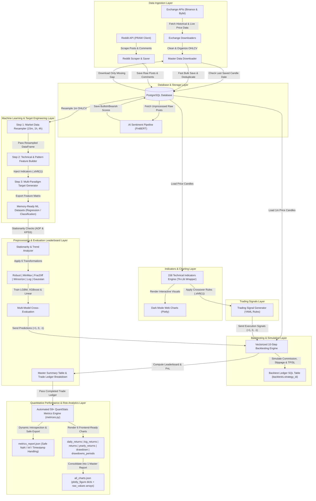

<div align="center">

# 🚀 CryptoSight: Enterprise Quantitative Data & Technical Analysis Engine

[](https://www.linkedin.com/in/afnan-shoukat/)
[](https://github.com/21Afnan)
[](https://python.org)
[](https://postgresql.org)
[](https://ta-lib.org)
[](https://plotly.com)

**An institutional, production-grade cryptocurrency data ingestion, dynamic technical analysis, ML feature engineering, and statistical analytics framework built for quantitative analysts and financial engineers.**

[🌟 Key Features](#-8-quantitative-pillars--core-architecture) • [🏗️ System Flowchart](#-system-architecture--pipeline-flowchart) • [⚡ Quick Start Guide](#-step-by-step-quick-start--execution-guide) • [📁 Repository Structure](#-complete-repository-structure) • [👨‍💻 Author](#-built--engineered-by-afnan-shoukat)

</div>

---

## 🌟 Executive Summary

**CryptoSight** bridges the gap between raw exchange data feeds and institutional quantitative strategies. It eliminates boilerplate data cleaning, API pagination headaches, and indicator mapping complexities by providing an end-to-end automated framework organized into **8 Quantitative Pillars**:

| Pillar | Module | High-Level Functionality |
| :--- | :--- | :--- |
| **1. Ingestion** | `cryptosight.data` | **Binance & Bybit Ingestion** with smart SQL gap-fill & live candle stripping (`latest_ts` synchronization). |
| **2. TA Engine** | `cryptosight.tal_Indicators` | **Dynamic 158 TA-Lib Wrapper** utilizing Python `__getattr__` interception with parameter hierarchy & dark-mode charts. |
| **3. Signals** | `cryptosight.signals` | **YAML-Driven Signal Pipeline** with look-back persistence windows and automatic `.shift(1)` look-ahead bias prevention. |
| **4. Backtester** | `cryptosight.backtesting` | **Vectorized 10-Step Backtesting Engine** simulating realistic commissions, slippage, dynamic TP/SL, and SQL ledger storage. |
| **5. Sentiment** | `cryptosight.sentiment` | **Reddit NLP Pipeline** with HTML/contraction cleaning, bot filtering, and **Hugging Face FinBERT** chunk-averaging. |
| **6. ML Data** | `cryptosight.ml` | **Quant ML Feature Builder** generating lag-free features (`.shift(1)`), Log Return (`np.log`), and 3-class target matrices. |
| **7. Evaluation** | `cryptosight.preprocessing` | **Institutional Preprocessing & Leaderboard** testing ADF/KPSS stationarity across `Robust, MinMax, FracDiff, Winsorize, Log, Gaussian`. |
| **8. Analytics** | `cryptosight.stats` | **QuantStats Analytics & Frontend Charts Engine** computing 59+ ratios (`CAGR, Sharpe, Calmar`) and exporting `all_charts.json`. |

---

## 🏗️ System Architecture & Pipeline Flowchart


```mermaid
graph TD
    subgraph Data Ingestion Layer
        API["Exchange APIs (Binance & Bybit)"] -->|"Fetch Historical & Live Price Data"| Fetcher["Exchange Downloaders"]
        Fetcher -->|"Clean & Organize OHLCV"| Facade["Master Data Downloader"]
        Reddit["Reddit API (PRAW Client)"] -->|"Scrape Posts & Comments"| RedditScraper["Reddit Scraper & Saver"]
    end

    subgraph Database & Storage Layer
        Facade -->|"Check Last Saved Candle Date"| SQL_Check[("PostgreSQL Database")]
        SQL_Check -->|"Download Only Missing Gap"| Facade
        Facade -->|"Fast Bulk Save & Deduplicate"| SQL_Check
        
        RedditScraper -->|"Save Raw Posts & Comments"| SQL_Check
        SQL_Check -->|"Fetch Unprocessed Raw Posts"| AI_Sentiment["AI Sentiment Pipeline (FinBERT)"]
        AI_Sentiment -->|"Save Bullish/Bearish Scores"| SQL_Check
    end

    subgraph Indicators & Charting Layer
        SQL_Check -->|"Load Price Candles"| Engine["158 Technical Indicators Engine (TA-Lib Wrapper)"]
        Engine -->|"Render Interactive Visuals"| Dashboard["Dark Mode Web Charts (Plotly)"]
    end

    subgraph Trading Signals Layer
        Engine -->|"Apply Crossover Rules (.shift(1))"| Signals["Trading Signal Generator (YAML Rules)"]
    end

    subgraph Backtesting & Simulation Layer
        SQL_Check -->|"Load 1m Price Candles"| Backtester["Vectorized 10-Step Backtesting Engine"]
        Signals -->|"Send Execution Signals (+1, 0, -1)"| Backtester
        Backtester -->|"Simulate Commission, Slippage & TP/SL"| Ledger["Backtest Ledger SQL Table (backtests.strategy_id)"]
    end

    subgraph Machine Learning & Target Engineering Layer
        SQL_Check -->|"Resample 1m OHLCV"| ML_Resample["Step 1: Market Data Resampler (15m, 1h, 4h)"]
        ML_Resample -->|"Pass Resampled DataFrame"| ML_Features["Step 2: Technical & Pattern Feature Builder"]
        ML_Features -->|"Inject Indicators (.shift(1))"| ML_Target["Step 3: Multi-Paradigm Target Generator"]
        ML_Target -->|"Export Feature Matrix"| ML_Dataset["Memory-Ready ML Datasets (Regression / Classification)"]
    end

    subgraph Preprocessing & Evaluation Leaderboard Layer
        ML_Dataset -->|"Stationarity Checks (ADF & KPSS)"| PP_Stationarity["Stationarity & Trend Analyzer"]
        PP_Stationarity -->|"Apply 6 Transformations"| PP_Methods["Robust | MinMax | FracDiff | Winsorize | Log | Gaussian"]
        PP_Methods -->|"Train LGBM, XGBoost & Linear"| PP_Models["Multi-Model Cross-Evaluation"]
        PP_Models -->|"Send Predictions (+1, 0, -1)"| Backtester
        Backtester -->|"Compute Leaderboard & PnL"| PP_Leaderboard["Master Summary Table & Trade Ledger Breakdown"]
    end

    subgraph Quantitative Performance & Risk Analytics Layer
        PP_Leaderboard -->|"Pass Completed Trade Ledger"| Stats_Engine["Automated 59+ QuantStats Metrics Engine (metrices.py)"]
        Stats_Engine -->|"Dynamic Introspection & Safe Export"| Stats_JSON["metrics_report.json (Safe NaN / Inf / Timestamp Handling)"]
        Stats_Engine -->|"Render 6 Frontend-Ready Charts"| Stats_Plots["daily_returns | log_returns | returns | yearly_returns | drawdown | drawdowns_periods"]
        Stats_Plots -->|"Consolidate into 1 Master Report"| Stats_Master["all_charts.json (plotly_figure dicts + raw_values arrays)"]
    end
```

---

## 🛠️ 8 Quantitative Pillars & Core Architecture

Click on any section below to expand and inspect the complete mathematical, architectural, and engineering deep-dive:

<details>
<summary><b>1️⃣ Smart Gap Ingestion & Live Candle Protection (Data Engine)</b></summary>
<br>

* **Smart Gap Detection**: Queries PostgreSQL (`latest_ts`), calculates the exact delta against current UTC time, and downloads **only the missing bar interval**, eliminating redundant network calls and rate limits.
* **Live Candle Stripping**: Inspects the active bar's timestamp (`is_closed` check). If the candle is still open on the exchange, it is automatically discarded so only **100% finalized candles** enter persistent SQL tables.
* **Bulk PostgreSQL COPY**: Utilizes high-speed staging insertion (`pg_copy_from`) with automated deduplication across symbol and timeframe (`binance_btc_1m`).
</details>

<details>
<summary><b>2️⃣ Dynamic 158 TA-Lib "Magic" Wrapper (Technical Analysis)</b></summary>
<br>

* **Python Object Interception (`__getattr__`)**: Dynamically intercepts indicator method calls (e.g. `ind.rsi(14)` or `ind.macd()`), maps column schemas (`close`, `high`, `low`), resolves institutional defaults, and executes C-compiled TA-Lib operations in microseconds without hardcoding 158 separate methods.
* **Multi-Panel Plotly Dashboard**: Automatically synchronizes price candlesticks, volume bars, and multi-indicator oscillator subplots with dark-mode glassmorphism styling.
</details>

<details>
<summary><b>3️⃣ Look-Ahead Bias-Free Signal Pipeline (Signals Engine)</b></summary>
<br>

* **YAML Rule Engine**: Evaluates complex multi-indicator logical crossovers (`RSI < 30 AND MACD > Signal`) across configurable look-back persistence windows.
* **Strict Look-Ahead Prevention (`.shift(1)`)**: Every generated signal is shifted forward by exactly 1 bar so a signal generated at the close of Bar $T$ executes strictly at the open of Bar $T+1$.
* **Lightweight Storage**: Saves only `timestamp` and `signal` columns into `signals.{exchange}_{symbol}_{timeframe}`, dropping redundant OHLCV blobs to keep database queries lightning-fast.
</details>

<details>
<summary><b>4️⃣ Vectorized 10-Step Backtesting Engine (`cryptosight.backtesting`)</b></summary>
<br>

* **Execution Pricing**: Models trade entries and exits at `next_open` or `current_close` (`BacktestingEngine`).
* **Friction & Fee Modeling**: Incorporates round-trip broker commissions (`0.14%`) and market slippage (`0.06%`) on both entry and exit legs to reflect true real-world net PnL.
* **Dynamic Take-Profit & Stop-Loss Scanning**: Vector-scans future candle highs/lows inside each position window to trigger automated TP (`1.05x`) and SL (`0.98x`) exits.
* **Database-Only Ledger (`backtests.{strategy_id}`)**: Automatically creates a unique, collision-proof `strategy_id` (`binance_sol_1h_rsi_14`), saving the final audit ledger directly inside PostgreSQL while logging metadata to `metadata.backtest_data`.
</details>

<details>
<summary><b>5️⃣ AI Sentiment & Reddit NLP Pipeline (`cryptosight.sentiment`)</b></summary>
<br>

* **Intelligent Text Cleansing**: Unescapes HTML entities, expands English contractions (`i've` $\to$ `i have`), converts emojis to words, and strips bot spam/moderator announcements.
* **Sliding-Window FinBERT Chunking**: To overcome Hugging Face's 512-token limit, long posts are split into 500-character chunks with a 100-character overlap. Individual chunk probabilities are dynamically averaged to yield an accurate overall sentiment score (`Bullish / Bearish / Neutral`).
</details>

<details>
<summary><b>6️⃣ Quantitative ML Feature & Target Engine (`cryptosight.ml`)</b></summary>
<br>

* **Decoupled Single Source of Truth**: Central `main.py` orchestrates disk I/O and configuration (`load_config`), feeding `MLFeatureBuilder` (`features.py`).
* **3-Step In-Memory Quant Flow**:
  1. *Resample*: Converts `1m` database bars into any target timeframe (`15m`, `1h`, `4h`).
  2. *Lagged Features (`.shift(1)`)*: Calculates `EMA`, `RSI`, `MACD`, `DOJI`, and `ENGULFING` patterns, immediately shifting all features by 1 period to guarantee zero data leakage.
  3. *Target Paradigms*:
     * **Regression (Log Return)**: Continuous log return (`np.log(Close_future / Close_current)`) shifted `-horizon` bars into the future.
     * **Classification (Threshold Gate)**: Directional classes (`+1` Buy, `-1` Sell, `0` Hold) gated by `threshold: 0.002` (`0.20%`) so labels only trigger when price movement exceeds broker commissions and slippage.
     * **TimeSeries**: Raw future price sequence shifting (`shift(-horizon)`).
</details>

<details>
<summary><b>7️⃣ Preprocessing Leaderboard & Stationarity Suite (`cryptosight.preprocessing`)</b></summary>
<br>

* **ADF & KPSS Stationarity Testing (`stationarity.py`)**: Runs mathematical hypothesis tests against raw features to detect unit roots and non-stationary drift before training.
* **Baseline Backtest (`ACTUAL_DF_NO_MODEL`)**: Runs an unmodeled benchmark on raw target returns to establish true empirical trade frequency and baseline PnL.
* **6-Paradigm Preprocessing Comparison (`preprocessor.py`)**: Evaluates out-of-sample performance across `RobustScaler`, `MinMaxScaler`, `Winsorize`, `Fractional Differencing` (`frac_d = 0.35`), `Log Transformation`, and `Gaussian Quantile Mapping`.
* **Multi-Model Leaderboard (`models.py` & `backtest_runner.py`)**: Cross-evaluates `LightGBM`, `XGBoost`, and `Linear Regression`, feeding predictions directly into the `BacktestingEngine` to generate the unified **Master Summary Table (`BTC_final_summary_master_table.csv`)**.
* **Noise Reduction Proof**: Proves that continuous regression gates (`0.20%`) successfully eliminate 90% of sideways chop and broker commission drag (`360+ losing trades`) compared to raw classification coin-flips (`predict_proba > 0.50`).
</details>

<details>
<summary><b>8️⃣ Quantitative Performance & Risk Analytics Suite (`cryptosight.stats`)</b></summary>
<br>

* **Mark-to-Exit Accounting**: Connects to `backtest_ledger.csv`, indexing trade returns (`perc_pnl`) strictly by **`exit_time`** so equity curves and CAGR reflect exact cash realized when positions close.
* **Dynamic 59+ Metric Introspection (`metrices.py`)**: Uses Python `inspect.getmembers()` to discover and compute all scalar QuantStats functions (`cagr`, `sharpe`, `sortino`, `calmar`, `max_drawdown`, `win_rate`, `profit_factor`) dynamically without hardcoded maintenance.
* **Safe JSON Type Sanitization (`to_json_safe`)**: Recursively converts `numpy.float64`, `pd.Timestamp`, `float('nan')`, and `float('inf')` into clean strings and JSON `null` (`None`) rounded to 6 decimals, exporting `cryptosight/stats/metrics_report.json`.
* **6 Frontend-Ready Quant Visualizations (`plots.py`)**: Generates standalone interactive HTML charts and consolidates them into **1 master report (`all_charts.json`)**:
  1. `daily_returns`: Daily resampled / period returns (`%`)
  2. `log_returns`: Cumulative log returns trajectory (`%`)
  3. `returns`: Baseline cumulative equity curve (`%`)
  4. `yearly_returns`: Year-by-year compounded returns (`%`)
  5. `drawdown`: Portfolio underwater drawdown depth (`%`)
  6. `drawdowns_periods`: Top 5 worst drawdowns overlaid on `$100 Base` index.
* **Dual-Format `all_charts.json` Architecture**: Every entry in `all_charts.json` provides:
  * `"plotly_figure"`: Clean Plotly `data` and `layout` dicts with `.tolist()` enforced on all series to **permanently eliminate base64 `bdata` strings**, allowing instant `<Plotly />` component rendering.
  * `"raw_values"`: Direct JSON arrays (`[{"time": "...", "value": 1.8614}, ...]`) for Chart.js, Recharts, or custom React/Vue UI cards without parsing Plotly structures.
</details>

---

## ⚡ Step-by-Step Quick Start & Execution Guide

All modules can be executed with single commands from your terminal within the activated virtual environment (`venv\Scripts\activate`):

| Step / Action | Execution Command | Description |
| :--- | :--- | :--- |
| **1. Database Setup** | Create `.env` in root | Set `DB_HOST=localhost`, `DB_PORT=5432`, `DB_NAME=...`, `DB_USER=...`, `DB_PASSWORD=...` |
| **2. Binance Ingestion** | `python -m cryptosight.data.binance.main` | Fetches OHLCV bars, fills historical gaps, and writes to PostgreSQL. |
| **3. Bybit Ingestion** | `python -m cryptosight.data.bybit.main` | Synchronizes Bybit historical and live candle streams. |
| **4. Reddit Sentiment** | `python -m cryptosight.sentiment.main` | Scrapes Reddit posts, cleans text, and runs FinBERT classification. |
| **5. Signal Pipeline** | `python -m cryptosight.signals.main` | Evaluates `strategy_config.yaml` and outputs `signals_pipeline_output.csv`. |
| **6. Vectorized Backtest** | `python -m cryptosight.backtesting.backtest` | Simulates trades, fees, and TP/SL, saving ledger to `backtests.{strategy_id}`. |
| **7. ML Dataset Builder** | `python -m cryptosight.ml.main` | Resamples data (`15m/1h`), shifts features `.shift(1)`, and exports CSV to `ml/datasets/`. |
| **8. Preprocessing Suite** | `python -m cryptosight.preprocessing.main` | Runs stationarity checks, tests 6 scaling transforms, and cross-evaluates ML models. |
| **9. Trade Ledger Audit** | `python -m cryptosight.preprocessing.analyze_backtest_ledger` | Audits win rates, TP/SL hit ratios, and commission drag across models. |
| **10. Stats & Analytics** | `python -m cryptosight.stats.main` | Computes 59+ QuantStats metrics (`metrics_report.json`) and exports 6 charts (`all_charts.json`). |

---

## 📁 Complete Repository Structure

```text
cryptosight/
├── data/                          # Exchange downloaders with smart SQL gap fill & live bar protection
│   ├── binance/                   # Binance API fetcher, config.yaml, main.py & Windows run_binance.bat
│   └── bybit/                     # Bybit API fetcher, config.yaml, main.py & Windows run_bybit.bat
├── tal_Indicators/                # Dynamic __getattr__ wrapper for all 158 TA-Lib technical indicators
├── signals/                       # YAML-driven quant signal generator & multi-crossover rule engine
├── backtesting/                   # Vectorized 10-step backtester modeling commissions, slippage & SQL ledger
├── sentiment/                     # PRAW Reddit scraper, text cleaning engine & Hugging Face FinBERT classifier
├── ml/                            # Single-responsibility quant ML pipeline: resampler -> features -> targets
│   ├── main.py                    # Master I/O orchestrator and configuration loader
│   ├── features.py                # MLFeatureBuilder (Resampler + .shift(1) features + Log Return targets)
│   ├── ml_config.yaml             # YAML specifications for timeframes, features, and target horizons
│   └── datasets/                  # Auto-generated CSV datasets ready for model training
├── preprocessing/                 # Preprocessing benchmark suite & multi-model evaluation leaderboard
│   ├── pp.config.yaml             # YAML configurations for methods, model tasks & threshold gates
│   ├── main.py                    # Entry point executing stationarity -> transforms -> PnL leaderboard
│   ├── preprocessor.py            # Encapsulates Robust, MinMax, Winsorize, FracDiff, Log & Gaussian scaling
│   ├── stationarity.py            # Conducts Augmented Dickey-Fuller (ADF) & KPSS mathematical tests
│   ├── models.py                  # Trains LightGBM, XGBoost & Linear models across prep methods
│   ├── backtest_runner.py         # Passes model predictions directly into BacktestingEngine for PnL ranking
│   └── analyze_backtest_ledger.py # Deep-dive auditor checking win rates, TP/SL hits, and broker fee drag
├── stats/                         # Institutional statistical analytics & frontend charts suite
│   ├── main.py                    # Pipeline orchestrator: backtest execution -> metrics -> chart export
│   ├── metrices.py                # Dynamic inspect auto-discovery engine for 59+ QuantStats ratios
│   ├── plots.py                   # Generates 6 quant charts + dual-format all_charts.json (plotly_figure + raw_values)
│   ├── metrics_report.json        # Exported JSON report of all 59+ strategy performance ratios
│   └── charts/                    # Directory containing all 6 HTML interactive charts and all_charts.json
├── csv_files/                     # Automated export directory for predictions, reports & master tables
├── logs/                          # Rotating execution logs (binance.log, bybit.log, db.log, nlp.log)
├── utils/                         # Shared utilities (config loader, PostgreSQL connection pooling & UTF-8 logger)
├── .env                           # Database & Reddit API credentials (git-ignored)
└── requirements.txt               # Python package dependencies
```

---

<div align="center">

## 👨‍💻 Built & Engineered by Afnan Shoukat

**Full-Stack Quantitative Engineer • Financial Data Scientist • Algorithmic Systems Architect**

[](https://www.linkedin.com/in/afnan-shoukat/)
[](https://github.com/21Afnan)

*Designed with enterprise precision, zero data leakage, and institutional quantitative rigor.*

© 2026 CryptoSight. All rights reserved.

</div>
