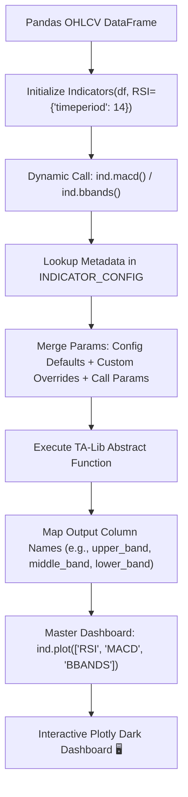

# 🚀 CryptoSight: Quantitative Trading Data & Technical Analysis Engine

**CryptoSight** is an enterprise-grade, fully automated cryptocurrency data ingestion and quantitative technical analysis framework. It seamlessly fetches historical and real-time OHLCV (Open, High, Low, Close, Volume) candlestick data from top exchanges (**Binance** and **Bybit**), stores it directly into a **PostgreSQL database** in timezone-independent UTC format, and powers interactive technical analysis across **158 TA-Lib indicators** via a dynamic Python wrapper.

Designed for quantitative analysts, algorithmic traders, and financial engineers, CryptoSight eliminates boilerplate data cleaning and indicator mapping, allowing you to go from raw market feeds to multi-panel interactive trading dashboards in just a few lines of Python.

---

## ✨ Key Features

### 📊 Ingestion & Data Management
- **🔄 Smart Gap Ingestion**: Automatically queries PostgreSQL for the latest stored timestamp (`latest_ts`) and downloads *only* the missing gap up to `now`. Zero redundant API fetching.
- **⚡ Unified Master Pipeline**: A clean facade pattern (`run_pipeline`) where initializing the orchestrator, fetching data, merging gaps, and database storage are controlled via a single call.
- **🛡️ Live Candle Protection**: Safely detects and drops unclosed active live candles (e.g., the current minute candle in progress), ensuring only finalized candles are written to SQL.
- **📦 Multi-Exchange Clients**: Specialized high-performance fetchers for **Binance** and **Bybit** (including automated forward chunk pagination for large historical queries).
- **⏱️ Intelligent Resampling**: Translates crypto timeframe notations (`1m`, `5m`, `15m`, `1h`, `1d`) into standardized Pandas time-series rules (`1min`, `5min`) with automated open/high/low/close/volume aggregation.

### 📈 Technical Indicators & Visualization (`tal_Indicators`)
- **🔮 Magic 158 Indicator Wrapper**: Uses Python magic methods (`__getattr__`) to dynamically wrap every single TA-Lib function. Calculate any indicator as a direct method call: `ind.rsi()`, `ind.macd()`, or `ind.bbands()`.
- **🎛️ 3-Tier Parameter Override Hierarchy**: Intelligently resolves indicator parameters by merging **Institutional Config Defaults** $\rightarrow$ **Constructor Global Overrides** $\rightarrow$ **Method Call Arguments**.
- **📚 Institutional Metadata Catalog (`config.py`)**: Auto-generated source of truth defining standardized `category`, `display_name`, input columns, `parameters` (with `type`, `default`, and `description`), and structured `outputs` (`name`, `return_type`, `description`) across all 158 indicators.
- **🖥️ Master Quantitative Dashboard (`ind.plot()`)**: One-call Plotly interactive charting suite that stacks Price Candlesticks and dynamic technical indicator subplots vertically on a dark-mode theme.

---

## 📁 Repository Structure

```text
cryptosight/
├── data/
│   ├── binance/
│   │   ├── binance_client.py      # Binance API fetcher with automatic retry & timestamp normalization
│   │   ├── config.yaml            # YAML settings (symbols, timeframe, date ranges, retry rules)
│   │   └── main.py                # Single-call execution script for Binance ingestion
│   ├── bybit/
│   │   ├── bybit_client.py        # Bybit API fetcher with forward chunk pagination loop
│   │   ├── config.yaml            # YAML settings for Bybit ingestion
│   │   └── main.py                # Single-call execution script for Bybit ingestion
│   └── downloader.py              # Master orchestrator (run_pipeline, download, get_data, resample)
├── tal_Indicators/
│   ├── config.py                  # Institutional catalog of 158 TA-Lib indicators & schema definitions
│   └── indicators.py              # Dynamic Indicators class wrapper & Plotly master dashboard engine
├── logs/
│   ├── binance.log                # Rotating log file for Binance execution
│   ├── bybit.log                  # Rotating log file for Bybit execution
│   └── db.log                     # Database connection and query execution logs
├── utils/
│   ├── config.py                  # YAML loader and timestamp normalization utility
│   ├── db.py                      # PostgreSQL schema, table creation, and bulk COPY loader
│   └── logger.py                  # Rotating file and console logger configuration
├── .env                           # Database environment variables (git-ignored)
├── requirements.txt               # Python package dependencies
└── README.md                      # Project documentation
```

---

## ⚙️ Architecture & Data Flow

### 1. Ingestion Pipeline Flow

```mermaid
graph TD
    User["Terminal Execution (main.py)"] --> Config["Load YAML Config & Logger"]
    Config --> Runner["Call Master Runner: run_pipeline()"]
    Runner --> DB_Check["Check PostgreSQL: Get latest_ts"]
    
    DB_Check -->|Table Empty| Fetch_Start["Fetch from config start_time"]
    DB_Check -->|Table Exists| Fetch_Gap["Fetch gap from latest_ts to now"]
    
    Fetch_Start --> API["Exchange API (Binance / Bybit)"]
    Fetch_Gap --> API
    
    API --> Clean["Normalize Timestamps & Drop Unclosed Live Candle"]
    Clean --> Fill["Inline Data Cleaning (ffill / bfill)"]
    Fill --> Dedupe["Deduplicate Indices (~duplicated keep='last')"]
    Dedupe --> Save["Bulk SQL Insert via COPY & Temp Table"]
    Save --> Success["Pipeline Complete 🚀"]
```

### 2. Dynamic Indicators & Dashboard Flow

```mermaid
graph TD
    DF["Pandas OHLCV DataFrame"] --> Init["Initialize Indicators(df, RSI={'timeperiod': 14})"]
    Init --> Call["Dynamic Call: ind.macd() / ind.bbands()"]
    Call --> ConfigLook["Lookup Metadata in INDICATOR_CONFIG"]
    ConfigLook --> Merge["Merge Params: Config Defaults + Custom Overrides + Call Params"]
    Merge --> Talib["Execute TA-Lib Abstract Function"]
    Talib --> Format["Map Output Column Names (e.g., upper_band, middle_band, lower_band)"]
    Format --> Plot["Master Dashboard: ind.plot(['RSI', 'MACD', 'BBANDS'])"]
    Plot --> Chart["Interactive Plotly Dark Dashboard 🖥️"]
```

---

## 🛠️ Setup & Installation

### 1. Requirements & Virtual Environment
Ensure you have **Python 3.10+**, **PostgreSQL**, and **TA-Lib** installed.

```bash
# Create and activate virtual environment
python -m venv venv
venv\Scripts\activate  # Windows PowerShell

# Install dependencies
pip install -r requirements.txt
```

### 2. Database Configuration (`.env`)
Create a `.env` file in the root workspace directory with your PostgreSQL credentials:

```env
DB_HOST=localhost
DB_PORT=5432
DB_NAME=postgres
DB_USER=postgres
DB_PASSWORD=your_password
```

---

## 🚀 Usage Examples

### 1. Automated Data Ingestion
Execute the ingestion script directly from any working directory:

```powershell
# Run Binance ingestion
python data/binance/main.py

# Run Bybit ingestion
python data/bybit/main.py
```

### 2. In-Memory Gap Fetching & Resampling
Load historical candles from PostgreSQL, merge them with live exchange gap data in RAM, and resample timeframes on the fly:

```python
from cryptosight.data.downloader import Downloader

dl = Downloader(exchange="bybit", symbol="btc", timeframe="1m")

# Get combined DB + Live gap dataframe
df = dl.get_data(start_time="2026-06-22 00:00:00", end_time="now")

# Automatically resample 1-minute data into clean 5-minute candles
original_1m, resampled_5m = dl.resample(target_timeframe="5m", start_time="2026-06-22 00:00:00", end_time="now")
print(resampled_5m.tail())
```

### 3. Quantitative Analysis & Interactive Dashboard
Calculate technical indicators and render a comprehensive interactive trading dashboard:

```python
from cryptosight.data.downloader import Downloader
from cryptosight.tal_Indicators.indicators import Indicators

# 1. Fetch live market data
dl = Downloader(exchange="bybit", symbol="btc", timeframe="1m")
df = dl.get_data(start_time="2026-06-25 00:00:00", end_time="now")

# 2. Initialize Indicators wrapper with custom global overrides
ind = Indicators(
    df,
    RSI={"timeperiod": 14},
    BBANDS={"timeperiod": 20, "nbdevup": 2.0, "nbdevdn": 2.0}
)

# 3. Compute indicators directly as Python methods
rsi_df = ind.rsi()
macd_df = ind.macd()          # Returns columns: ['macd', 'signal', 'histogram']
bbands_df = ind.bbands()      # Returns columns: ['upper_band', 'middle_band', 'lower_band']

print("MACD Output:")
print(macd_df.tail(2))

# 4. Launch multi-panel interactive Plotly dashboard in ONE call!
ind.plot(["RSI", "MACD", "BBANDS"])
```
